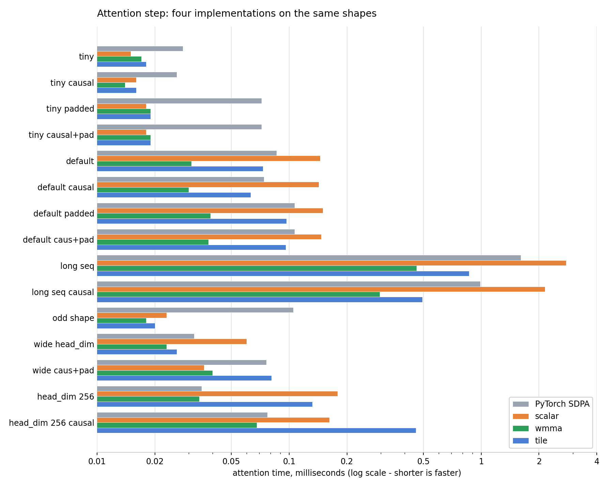
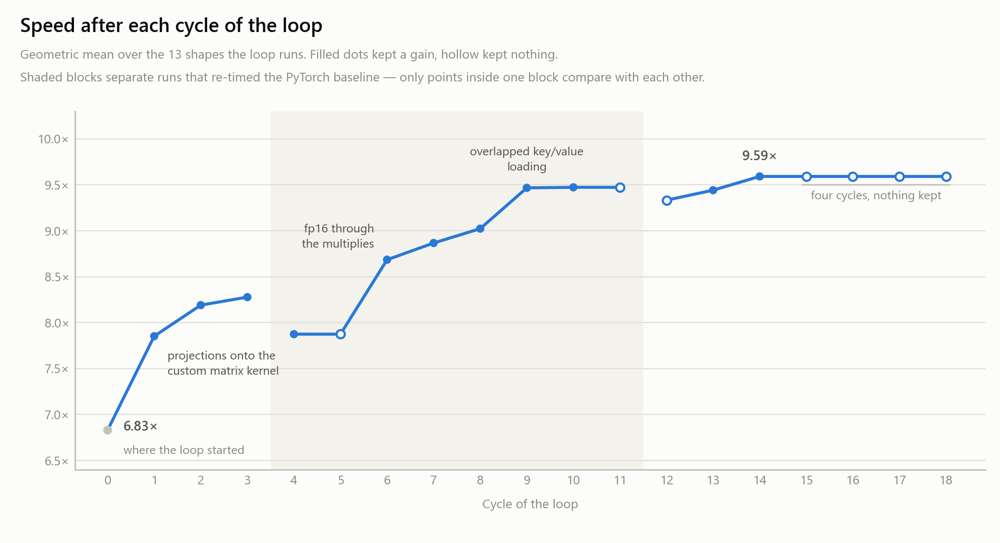

# Distraction - *A faster GPU Kernel for Transformer Layers*


A submission to **TikTok TechJam 2026, Problem Statement 3: "Implement a GPU Kernel for a
Transformer Layer."** It runs the same Transformer layer as the reference implementation, produces
the same answers, and runs faster.

**The full write-up is [TechnicalReport.md](TechnicalReport.md)**, and it follows the path the work
took: profiling the baseline to find where the time actually went, building the custom attention
kernel that stops the wasted memory traffic, then an AI-driven optimization loop that measured every
further idea and kept the twenty-five that earned it, the dispatch architecture that decides which
kernel runs for which input, and the limitations that remain. This README covers what it is, how to
build it, and how to reproduce the numbers.

- [Project overview](#project-overview)
- [Setup and installation](#setup-and-installation)
- [The benchmark dashboard](#the-benchmark-dashboard)
- [Reproducing the results](#reproducing-the-results)
- [Limitations, and what I would improve](#limitations-and-what-i-would-improve)
- [Team](#team)
- [Further reading](#further-reading)

---

## Project overview

### The task

A **Transformer** is the design behind most modern AI systems. A **kernel** is a small program that
runs on the graphics card (GPU) rather than the main processor. The task was to write faster kernels
for one Transformer layer.

The catch is accuracy. Every number the fast version produces must be **within 0.002** of the
reference or **within 2%** of it, and the benchmark skips the timing entirely if the check fails —
so a speedup number always belongs to a correct result.

> Make it faster without meaningfully changing the answers.

That shapes almost every decision here, because the obvious ways to gain speed — less precise
numbers, mathematical shortcuts — are exactly the ways to fail the check.

### Why the original is slow

The heart of a Transformer is **self-attention**: every word compares itself against every other
word and scores how relevant each one is. Those scores form a grid, one number per pair of words.

That grid is the problem. Double the length of the text and it *quadruples*. At 2048 words it is
128 MiB for a single layer — and the reference sends it out to the card's main memory and reads it
back five separate times, once each to create it, rescale it, mask it, convert the scores to
weights, and use it. Real arithmetic falls from 70% of the time at short inputs to **under a third**
at long ones; the rest is data being moved. Very small inputs are slow for the opposite reason: the
card finishes each piece of work before the next arrives and spends the pass waiting.

### What was built

Attention was rewritten so the grid of scores is built, masked, scored and used **in small pieces
that never leave the chip's fast on-chip memory**. Three complete versions exist: a tensor-core
kernel (the default, running both of attention's multiplications on the card's matrix-multiply
hardware), a simple one-thread-per-word kernel that covers older cards and serves as the correctness
reference, and a tile kernel in NVIDIA's newer high-level style, kept as a comparison.

**There is no prebuilt attention anywhere in this project.** Implementing attention *is* the task,
so a size nothing covers is reported as an error rather than quietly handed to somebody else's code.

The tensor-core kernel is the fastest of the three on every shape, and beats PyTorch's own fused
attention by **1.7× to 5.8×** everywhere except the widest head size, where the two tie. That is
what makes it the default:



Which kernel runs for which input is decided on the processor before anything reaches the card, so
the card never waits for the answer — laid out in [TechnicalReport.md](TechnicalReport.md) section 7,
and drawn out one decision at a time in [attention_dispatch_graph.md](attention_dispatch_graph.md).

Around that sit twenty-four further changes — fusing neighbouring steps, hand-written tensor-core
kernels for every large multiplication, skipping regions of the grid that would be thrown away, and
recording the whole sequence of GPU commands so it replays as a single instruction.

The later ones came out of an **autonomous optimization loop**: an agent proposes a change, builds
it, times it, and keeps it only if every shape still passes the accuracy check, the overall score
improves and no shape regresses more than 1%. Eighteen cycles took the thirteen shapes it runs from
6.83× to 9.59×, and the cycles that kept nothing are as visible as the ones that worked:



Each change and its measured effect is in [TechnicalReport.md](TechnicalReport.md); every cycle,
accepted or rejected, is in [docs/OPTIMIZATION_LEDGER.md](docs/OPTIMIZATION_LEDGER.md).

### The machine everything was measured on

Every number in this project comes from one machine:

| Part | Detail |
| --- | --- |
| **Graphics card** | **NVIDIA GeForce RTX 3070, 8 GB** — Ampere generation, driver 610.47 |
| Processor | AMD Ryzen 7 5800X |
| Memory | 32 GB DDR4 |
| Operating system | Windows 11 |
| GPU toolkit | NVIDIA CUDA 13.3 |
| C++ compiler | Microsoft Visual C++ 14.44 |
| Framework | PyTorch 2.12, Python 3.10 |

The card is the part that matters: it sets which kernels can run at all, and every tuned constant
was chosen by measurement on it. A faster card would starve at larger input sizes, a slower one at
smaller ones.

### Results

All fourteen official test cases. Every one passes the accuracy check, with **zero** failing numbers
out of the 6.93 billion compared.

| Across all fourteen | Speedup |
| --- | ---: |
| Average (geometric mean) | **10.04×** |
| Median | **13.75×** |
| Best — a batch of 4 | **46.93×** |
| Worst — a batch of 10,000 | **1.52×** |
| Cases at 4× or better | 11 of 14 |
| Cases failing the accuracy check | **0 of 14** |


**The spread is wide, and it is not random.** The biggest gains are where the card was sitting idle,
and the next tier is where the grid of scores dominates. The two smallest are cases where the
original was already efficient — the widest model, where the rest of the layer dwarfs attention, and
a batch of 10,000, whose working set does not fit in 8 GB. Both are hardware limits no kernel change
reaches. The per-case reasoning is in [TechnicalReport.md](TechnicalReport.md), section 9.

### What is in the repository

| Location | What is in it |
| --- | --- |
| `csrc/` | The GPU code — every kernel, about 6,600 lines |
| `optimized/` | The Python side: the rewritten layer, and which kernel runs when |
| `scripts/` | Correctness checks and measurement scripts |
| `dashboard/` | A local web page for running benchmarks and reading the results |
| `docs/` | The optimization ledger, the loop's system prompt, and the write-ups |
| `torch_transformer_benchmark.py` | The organizers' benchmark, with this project wired into it |

---

## Setup and installation

### What you need

| Requirement | Detail |
| --- | --- |
| Graphics card | An NVIDIA card. Compute capability 8.0 or newer for the tensor-core kernel; older cards fall back to the simple one |
| Operating system | Windows. Every command below is PowerShell or `cmd`, and the build script finds MSVC the Windows way |
| CUDA Toolkit | 13.3 or newer |
| PyTorch | 2.12 or newer, with CUDA support (2.12 and 2.13 both build here) |
| Python | 3.10 or newer |
| Compiler | MSVC — Visual Studio with the "Desktop development with C++" workload |
| Build tool | `ninja` |

The commands in this README are written for **PowerShell** or `cmd`. In Git Bash a backslash is an
escape character, so `scripts\devenv.bat` arrives as `scriptsdevenv.bat` — use forward slashes
there, or run them from PowerShell.

The GPU code is compiled on your own machine on first use, so a C++ compiler is genuinely required.
There is no PyTorch-only shortcut: the kernels *are* the project, and a build that fails stops the
benchmark rather than quietly measuring something else.

### 1. Install the Python packages

```bash
pip install -r requirements.txt
```

That installs PyTorch and `ninja`, and nothing else — everything else this project uses comes with
Python itself. That includes the whole dashboard: its server is Python's own `http.server`, its job
queue is `threading` and `queue`, its parsing is `json`, `csv` and `ast`, and its front end is one
HTML file, one stylesheet and one script with no framework and no code fetched from a third party.

The version of PyTorch has to match your CUDA Toolkit, so `requirements.txt` points pip at NVIDIA's
build of it rather than the default one. If your toolkit is not 13.x, change the `cu132` in that
file to match. A mismatch between the two is the usual cause of build failures, and plain
`pip install torch` on Windows gives a version with no GPU support at all.

### 2. Build the GPU code

```bash
cmd.exe /c scripts\build_ext.bat
```

It should finish with:

```
[build_ext] OK -> ...\build\transformer_kernels.pyd
```

A cold build — no `build/` directory at all — takes two to four minutes; measured here at 156 s
against PyTorch 2.13 and 214 s against 2.12. After that it is near-instant, and editing any GPU
source file triggers a rebuild automatically, so there is no separate build step to remember.

Visual Studio's compiler is not available in an ordinary terminal, only in its own developer
prompt. `scripts\build_ext.bat` finds it and sets that up for you, which is why the command goes
through the script rather than calling Python directly.

### 3. Check it works

```bash
cmd.exe /c scripts\devenv.bat python scripts\verify_kernel.py
```

This runs every kernel against a reference on fifteen different input sizes and compares the results
number by number. It should end with:

```
every kernel matches the reference on every case
```

Two more checks are worth running after a build:

```bash
cmd.exe /c scripts\devenv.bat python scripts\verify_attn_axes.py   # every kernel and format combination
cmd.exe /c scripts\devenv.bat python scripts\verify_graph.py       # the recorded version matches the normal one exactly
```

### 4. Find the CUDA graph gate value for your machine (Optional)

Optional, and only worth doing on a card that is not an RTX 3070.

One optimization records the whole sequence of GPU commands once and replays it as a single
instruction. That only pays off while the card is being starved of work — on large inputs it has
nothing to give, so it is switched off above a size threshold. The threshold shipped here was
measured on this project's card. A faster card starves at larger sizes and wants a **larger**
value; a slower one wants a smaller one.

To re-derive it on your own machine:

```bash
cmd.exe /c scripts\devenv.bat python scripts\ab_graph.py --recommend
```

It sweeps the size axis and prints the value to use. Put that number in `_GRAPH_MAX_ACTIVATION`
in [optimized/config.py](optimized/config.py), which carries the same explanation next to it.

Getting this wrong is cheap in both directions: too low leaves some speed unclaimed, too high
holds on to a little memory for no gain. Neither can change an answer — the replayed version is
bit-for-bit identical to the ordinary one at any setting.

### If something goes wrong

**"the CUDA extension failed to load, and there is no fallback."** The compiler was not found. Run
the command through `scripts\devenv.bat`, which puts it on the path first:

```bash
cmd.exe /c scripts\devenv.bat python torch_transformer_benchmark.py
```

**"unsupported Microsoft Visual Studio version", or a crash inside `cudafe++`.** NVIDIA's compiler
only accepts a range of Visual Studio versions, and Visual Studio defaults to the newest one it has.
The build script pins version 14.44; change it if your CUDA version wants a different one:

```bash
set VCVARS_VER=14.43
cmd.exe /c scripts\build_ext.bat
```

If that version is not installed, the script lists the ones that are.

**"'vswhere.exe' is not recognized."** Harmless. The build succeeds anyway.

**"Cannot open include file: 'ATen/ops/…​.h'", naming a header that is plainly there.** Windows'
260-character path limit, not a broken PyTorch install. Some ATen headers have very long names, so a
deeply nested Python environment pushes them over the line and the compiler reports them as missing.
Move the environment — or the repository — somewhere shorter, or enable long paths:

```powershell
reg add HKLM\SYSTEM\CurrentControlSet\Control\FileSystem /v LongPathsEnabled /t REG_DWORD /d 1 /f
```

**It runs, but is slower than expected.** Check which kernel actually ran by passing `--attn-impl`.

---

## The benchmark dashboard

Tuning a kernel means running the same measurement hundreds of times, and the rules that make a
measurement *mean* something are easy to skip when you are typing the command by hand. So the
second thing built here is a local web page that runs the benchmarks for you and enforces those
rules automatically.

```bash
python -m dashboard
```

| Tab | What it is for |
| --- | --- |
| **Run** | One configuration, on one test case or on all fourteen. Fills the table row by row and reports the geometric mean |
| **Compare** | Two configurations against the same cases, timed alternately, with a control run to establish the noise floor |
| **Profile** | One traced run under NVIDIA Nsight — where the time inside a pass actually goes, and per-kernel counters saying whether a kernel is limited by arithmetic or by memory |
| **Scripts** | Every script in `scripts/`, with a form built automatically from its own arguments |
| **Presets** | The fourteen official test cases, editable in a table and validated by the same rule the benchmark applies |
| **History** | Every finished run, with its full log |

Full instructions are in [dashboard/README.md](dashboard/README.md) — every tab and every
control, the measurement rules it enforces, and what it refuses to run and why.


---

## Reproducing the results

### The easiest way

```bash
python -m dashboard
```

This opens a local web page. To run the full set of official test cases:

1. Go to the **Run** tab.
2. In the **Shape** card, switch the toggle from *One shape* to **Many shapes**.
3. Leave every preset selected — those are the fourteen official test cases, ticked by default.
   Anything the current settings cannot run is greyed out and skipped.
4. In the **Optimizations** card, leave everything on **auto**. That is the configuration the
   results were measured with, and the one the benchmark uses by default.
5. Press **Run benchmark**.

The cases run one at a time and fill in a row each: whether it passed the accuracy check, its worst
error, how many numbers failed, the two timings, and the speedup. Above the table, the summary
gives the geometric mean across them.

The page does not change how anything is measured. Every number in it is printed by the benchmark
itself, and the exact command is shown before it runs, so any row can be traced back to something
you could type into a terminal yourself. The server never touches the graphics card; each run is a
separate process that exits and gives its memory back when it finishes.

The **Compare** tab does the same for two configurations side by side, and **Profile** shows where
the time inside a single pass actually goes.

### From the command line

One configuration at a time:

```bash
cmd.exe /c scripts\devenv.bat python torch_transformer_benchmark.py --batch-size 64 --seq-len 128 --d-model 128 --heads 4 --ffn-dim 128 --layers 4 --causal
```

That is the first of the official test cases. All fourteen are listed in
`dashboard/presets.json` with a note on what each one varies. The benchmark checks accuracy first
and skips the timing entirely if it fails, so a speedup number always belongs to a correct result.

The largest case — 32 sequences of 100,000 words — needs no special flags. The benchmark works out
that it will not fit in memory, splits the batch into pieces, and skips the reference implementation
because that cannot run at all.

To measure one change on its own, four switches turn the main optimizations on and off:

| Switch | What it changes |
| --- | --- |
| `--attn-impl` | Which attention kernel runs: `auto`, `scalar`, `wmma` (tensor cores) or `tile` |
| `--attn-precision` | How precisely it calculates: `auto`, `fp32` (full precision), or `tf32`, `fp16` and `bf16` (progressively less, and progressively faster) |
| `--linear-gelu` | Whether two steps of the feed-forward part are fused into one kernel |
| `--cuda-graph` | Whether the GPU command sequence is recorded and replayed |

Forcing a kernel onto a size it does not cover reports an error rather than silently using a
different one, so a measurement can never be attributed to the wrong kernel.

### Rules that keep the numbers honest

Three rules sit behind every figure quoted here, and the dashboard enforces all three:

1. **Never compare timings from separate runs.** Graphics cards slow themselves down as they heat
   up, so two versions have to be timed alternately within one session to face the same conditions.
   One block size appeared to win by 1.58× measured separately, and placed fourth of five when timed
   properly.
2. **Always run a control.** Run the same version against itself. The true answer is exactly 1.00×,
   so whatever it actually reports is how much the machine is varying at that moment — and any real
   difference has to beat that to mean anything.
3. **Timing and profiling are different jobs.** Profiling tools inflate the numbers they collect, so
   the Profile tab reports proportions and never a speedup.

---

## Limitations, and what I would improve

**The matrix-multiply hardware is barely used.** The kernels do reach the card's dedicated
matrix-multiply units, but the counters show they spend only 13% of their time actually running
them, and occupy 22% of what the card could be doing at once. Every kernel in the model turns out to
be limited by memory speed rather than by arithmetic. Two things follow: there is real headroom
left, and it will not come from doing less arithmetic — the kernels are waiting on data. Further
gains have to come from moving less of it, or from keeping more work resident so the waiting
overlaps with something useful.

**Everything is tuned for exactly one machine.** None of the numbers that make this fast were
derived — they were measured, on one card, and they do not transfer. When the kernel sequence is
recorded and replayed, when the whole post-attention chain collapses into a single kernel, which
normalisation kernel runs, and every attention tile size: all of it is a constant picked by
sweeping the options and keeping the fastest.

On a different card several of those move in ways that are not obvious. The recording threshold, for
instance, should get **larger** on a faster card, not smaller — it marks the point where the card
stops running out of work between instructions, and a quicker card reaches that point at a bigger
workload. Anyone reusing this on other hardware would have to re-measure all of it, and the sweeps
that produced these values take hours.


**The design grew rather than being planned.** I had a solid foundation in the basics of GPU
programming, but the specific ground this project stands on was learned over a few days while
building against it. Several of the rules that decide which kernel runs exist because of a
measurement rather than because the structure needed them. The results are measured and they hold,
but a second attempt would be simpler and — given that the kernels are nowhere near the card's
limits — faster.

**Given more time, that is where it would go**, before it went on new features.

---

## Team

**Solo project**

---

## Further reading

| Document | What it covers |
| --- | --- |
| **[TechnicalReport.md](TechnicalReport.md)** | The full write-up: the problem, the tools used, why the original is slow, all twenty-five optimizations and what each was worth, results, limitations, and the AI-use disclosure. **Start here.** |
| [attention_dispatch_graph.md](attention_dispatch_graph.md) | Which kernel runs for which input, as a diagram |
| [docs/OPTIMIZATION_LEDGER.md](docs/OPTIMIZATION_LEDGER.md) | Every optimization ever proposed — accepted, measured-and-rejected, or killed before a line was written — with the measurement behind each verdict |
| [docs/goal_prompt.md](docs/goal_prompt.md) | The system prompt the autonomous optimization loop runs to: its scope, its rules, and its accept/reject gate |
| [dashboard/README.md](dashboard/README.md) | The benchmark dashboard in full: every tab, the measurement rules it enforces, the preflight checks that refuse impossible runs, how the form stays in sync with the harness, and how runs are stopped and cleaned up |
| [docs/Record.md](docs/Record.md) | The engineering record: every measurement in the order it was taken, including the ones that came back negative |
| [csrc/TUNING.md](csrc/TUNING.md) | The measurements behind every tuned constant in the kernels |
