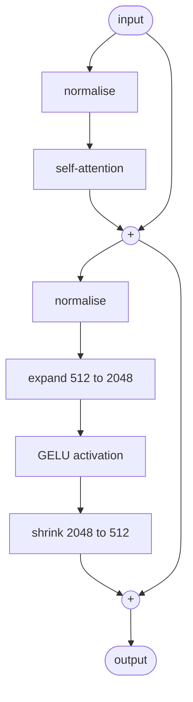
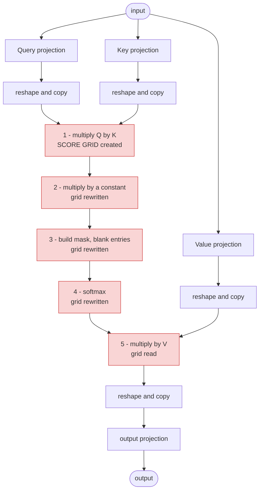
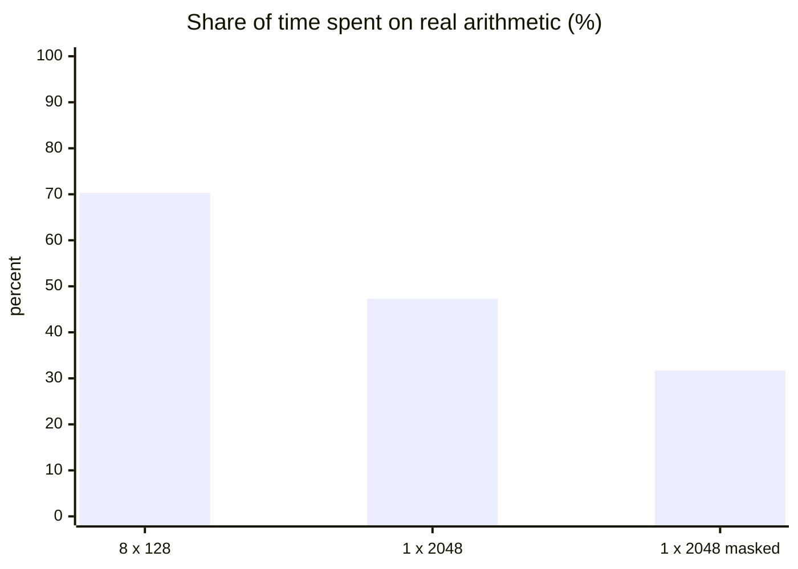
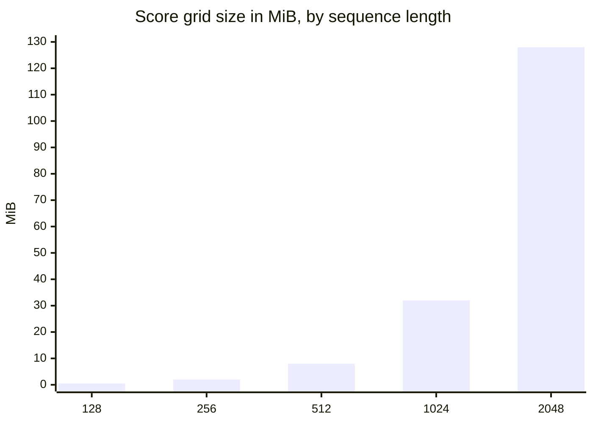
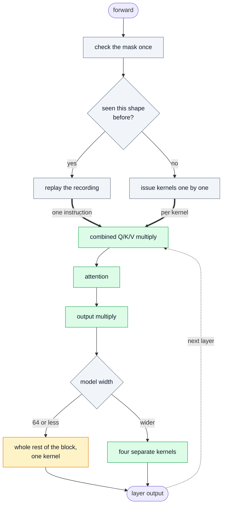
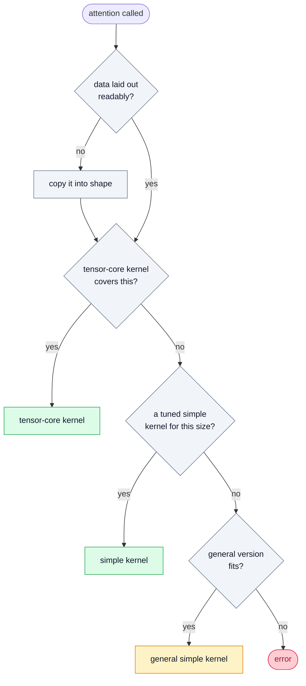
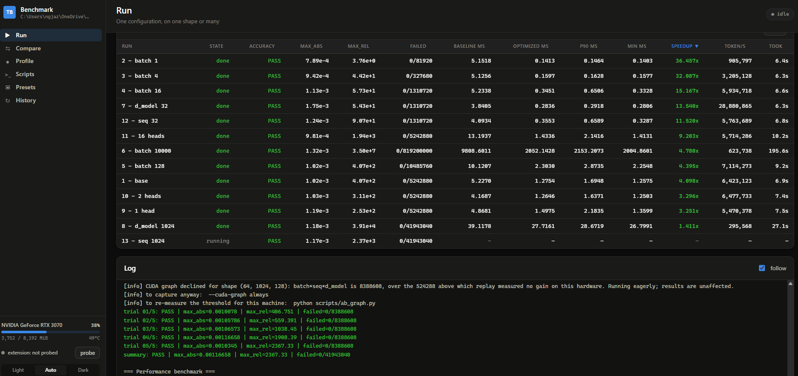
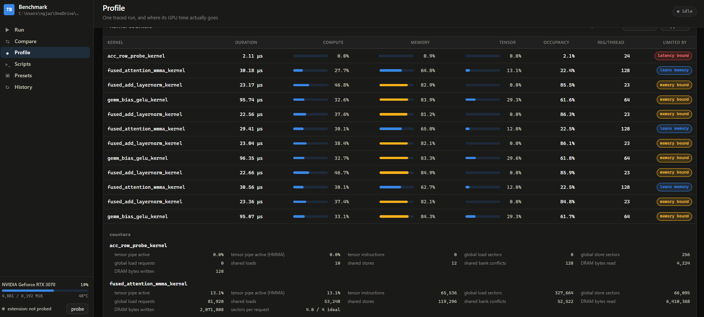

# *Distraction*, A faster attention layer for Transformers Technical Report

## Contents

- **[1. The Problem and the Goal](#1-the-problem-and-the-goal)**
    - [1.1 Where this comes from](#11-where-this-comes-from)
    - [1.2 What a Transformer layer does](#12-what-a-transformer-layer-does)
    - [1.3 The goal, and the catch](#13-the-goal-and-the-catch)
    - [1.4 The approach, in brief](#14-the-approach-in-brief)
- **[2. Tech Stack](#2-tech-stack)**
    - [2.1 Hardware](#21-hardware)
    - [2.2 Operating system and build tools](#22-operating-system-and-build-tools)
    - [2.3 Languages and GPU programming interfaces](#23-languages-and-gpu-programming-interfaces)
    - [2.4 Framework and libraries](#24-framework-and-libraries)
    - [2.5 Supporting tools](#25-supporting-tools)
    - [2.6 Reference material](#26-reference-material)
    - [2.7 AI assistance and Skills](#27-ai-assistance-and-skills)
- **[3. The Baseline Implementation](#3-the-baseline-implementation)**
    - [3.1 What the baseline does](#31-what-the-baseline-does)
    - [3.2 Where the time actually goes](#32-where-the-time-actually-goes)
    - [3.3 The cost of longer sequences](#33-the-cost-of-longer-sequences)
    - [3.4 The problems](#34-the-problems)
    - [3.5 Goals for the project](#35-goals-for-the-project)
- **[4. Approach and Implementation](#4-approach-and-implementation)**
    - [4.1 Why C++/CUDA](#41-why-ccuda)
    - [4.2 First attempt: one thread per row](#42-first-attempt-one-thread-per-row)
    - [4.3 Moving to the tensor cores](#43-moving-to-the-tensor-cores)
    - [4.4 Tile programming](#44-tile-programming)
    - [4.5 Choosing between them](#45-choosing-between-them)
- **[5. The Optimizations Implemented](#5-the-optimizations-implemented)**
    - [5.1 Kernel-level optimizations](#51-kernel-level-optimizations)
    - [5.2 Execution-level optimizations](#52-execution-level-optimizations)
    - [5.3 Tuning the block shapes](#53-tuning-the-block-shapes)
- **[6. Architecture and Dispatch](#6-architecture-and-dispatch)**
    - [6.1 The forward pass](#61-the-forward-pass)
    - [6.2 Choosing the attention kernel](#62-choosing-the-attention-kernel)
    - [6.3 Precision is a separate choice](#63-precision-is-a-separate-choice)
    - [6.4 The decisions and their thresholds](#64-the-decisions-and-their-thresholds)
- **[7. Dashboard and Profiling](#7-dashboard-and-profiling)**
    - [7.1 What it is](#71-what-it-is)
    - [7.2 The measurement rules it enforces](#72-the-measurement-rules-it-enforces)
    - [7.3 Profiling](#73-profiling)
- **[8. Results](#8-results)**
    - [8.1 Reading the spread](#81-reading-the-spread)
    - [8.2 Shape 14, and the limits of an 8 GB card](#82-shape-14-and-the-limits-of-an-8-gb-card)
- **[9. Limitations](#9-limitations)**
    - [9.1 The matrix-multiply hardware is barely used](#91-the-matrix-multiply-hardware-is-barely-used)
    - [9.2 The accuracy margin belongs to the reference, not the kernel](#92-the-accuracy-margin-belongs-to-the-reference-not-the-kernel)
    - [9.3 The understanding behind this is newer than the results suggest](#93-the-understanding-behind-this-is-newer-than-the-results-suggest)
- **[10. AI Involvement During Development](#10-ai-involvement-during-development)**
    - [10.1 The tools, and what they enabled](#101-the-tools-and-what-they-enabled)
    - [10.2 What it could not be trusted with](#102-what-it-could-not-be-trusted-with)
    - [10.3 Working with AI, not instead of it](#103-working-with-ai-not-instead-of-it)

---

## Summary

A Transformer layer was rewritten to run faster on a graphics card, using custom GPU code in place
of the standard PyTorch operations, while keeping its output within the accuracy tolerance the
grader applies.

Measuring the original showed the problem was not arithmetic. Most of the time went on moving one
large table of numbers — the grid of relevance scores that attention produces — back and forth
between the card's fast on-chip memory and its main memory. At long sequences, real arithmetic
accounted for under a third of the time.

The rewrite computes that grid in small pieces that never leave the chip, runs both of attention's
multiplications on the card's dedicated matrix-multiply hardware, and combines neighbouring steps so
intermediate results stop making needless trips to memory. Nineteen further changes address what
remains, from redundant data copies to the cost of issuing thousands of small instructions.

**Results across all fourteen graded test shapes**, every one passing the accuracy check with zero
failing values:

| | Speedup |
| --- | ---: |
| Best (single sequence, batch 1) | **39.67×** |
| Median | **9.39×** |
| Geometric mean | **8.13×** |
| Worst (widest model, 1024) | **1.41×** |

The longest shape in the set — 100,000 words — goes from 43.2 seconds to 1.9 seconds per slice, and
a batch of 10,000 from 6.9 seconds to 1.1. The gain is largest where the original spent most of its
time waiting rather than computing, and smallest on the widest model, where it was already busy.

## 1. The Problem and the Goal

### 1.1 Where this comes from

TikTok TechJam 2026, **Problem Statement 3: "Implement a GPU Kernel for a Transformer Layer."**

A *kernel* is a small program that runs on the graphics card (GPU) instead of the main processor.
The two words mean the same thing throughout this report. The task is to write faster ones.

### 1.2 What a Transformer layer does

A **Transformer** is the design behind most modern AI systems — chatbots, translation, image
recognition, speech, recommendations. Its key idea is **self-attention**.

To understand the word "it" in a sentence, you need to know which earlier word "it" refers to.
Self-attention does this by having **every word compare itself against every other word** and
score how relevant each one is. Those scores then decide how much each word contributes to the
others' meaning.

Each word is turned into three representations:

- the **Query** — what a word is looking for,
- the **Key** — what a word offers to others,
- the **Value** — the information it passes on if it turns out to be relevant.

Comparing every Query against every Key produces a grid of relevance scores. Those scores are
converted into weights that add up to 100%, and the Values are blended according to those weights.

As a formula:

$$\text{Attention}(Q, K, V) = \text{softmax}\left(\frac{QK^T}{\sqrt{d_k}}\right)V$$

Read left to right: multiply the Queries by the Keys to get the score grid ($QK^T$), shrink the
scores by a fixed amount ($\sqrt{d_k}$) so they do not become extreme, convert them to weights
that sum to 100% (`softmax`), then use those weights to blend the Values ($V$).

**Why this is expensive.** The comparison is all-against-all. Doubling the length of the text does
not double the work — it *quadruples* it, because the grid of scores grows in both directions at
once.

A full layer does several other costly steps around this. Five things can be the bottleneck: raw
calculation speed, memory speed, cache efficiency, the overhead of starting work on the GPU, and
use of the GPU's specialised matrix-multiply hardware. Which one dominates depends on the size of
the input.

### 1.3 The goal, and the catch

**The goal:** take a reference implementation of a Transformer layer and make it run faster using
custom GPU code.

**The catch:** an automatic grader compares the fast version's output against the reference
version's output, number by number, and rejects it if the results drift too far apart.

> **Make it faster without meaningfully changing the answers.**

This constraint shapes almost every decision in the project, because the obvious ways to gain
speed — using less precise numbers, taking mathematical shortcuts — are exactly the ways to fail
the check.

The grader's rule, applied to every individual number in the output:

```
the difference is small in absolute terms      OR      the difference is small relative to the value
   (within 0.002)                                          (within 2%)
```

Every number must satisfy at least one of the two.

**Being more accurate than the reference does not help.** The grader does not compare against a
perfect answer. It compares against the reference implementation's own slightly-imperfect answer,
so what is rewarded is closeness to *that*, not correctness in the abstract.

### 1.4 The approach, in brief

- **A rewritten attention step** that keeps the grid of scores inside the GPU's small, fast
  on-chip memory instead of writing it out to the card's main memory and reading it back. That
  round trip, not the arithmetic, is the main cost at long input lengths.
- **Two versions of it**: one using the GPU's specialised matrix-multiply hardware, and a simpler
  one for cases and older cards that hardware cannot handle.
- **A third version** written in a newer, higher-level style NVIDIA now offers, used as a
  comparison between ease of writing and speed.
- **Fusing small steps together** — combining several kernels into one so intermediate results stay
  on-chip rather than making needless trips to memory.
- **Recording and replaying the GPU command list**, which removes the cost of issuing commands one
  at a time. This changes no arithmetic, and the code verifies the replayed version produces
  bit-for-bit identical output before using it.

---

## 2. Tech Stack

### 2.1 Hardware

| | |
| --- | --- |
| Processor (CPU) | AMD Ryzen 7 5800X |
| Memory (RAM) | 32 GB DDR4 |
| Graphics card (GPU) | NVIDIA GeForce RTX 3070, 8 GB |
| GPU generation | Ampere |
| Driver | 610.47 |

### 2.2 Operating system and build tools

| | |
| --- | --- |
| Operating system | Windows 11 |
| C++ compiler | Microsoft Visual C++ (MSVC) 14.44 |
| GPU compiler | NVIDIA CUDA Toolkit 13.3 |
| Build tool | `ninja`, invoked by PyTorch |
| Compiler discovery | `vswhere` and `vcvarsall.bat`, run by the project itself |
| Build model | GPU code compiled on first use and cached; edits trigger an automatic rebuild |

### 2.3 Languages and GPU programming interfaces

| | |
| --- | --- |
| Language | CUDA C++ — NVIDIA's extension of C++ for writing GPU programs |
| Main interface | `wmma`, which drives the GPU's matrix-multiply hardware directly |
| Comparison interface | NVIDIA's "tile" model, where work is described in larger blocks and the compiler handles the fine detail |
| Command recording | CUDA graphs, via PyTorch |

Number formats used, and where:

| Format | Precision | Where used |
| --- | --- | --- |
| **fp32** | Full | The format all data is stored in; the arithmetic of the simpler kernels |
| **fp16** | Reduced | Default for the attention kernel and the combined feed-forward kernel |
| **TF32** | Reduced | Selectable alternative on the same paths |
| **bf16** | Heavily reduced | One experimental tile mode only |

### 2.4 Framework and libraries

| | |
| --- | --- |
| Machine-learning framework | **PyTorch 2.12** — tensors, the reference implementation, and the benchmark harness |
| Bridge to custom code | PyTorch's `cpp_extension`, which compiles the CUDA code and makes it callable from Python |
| Matrix-multiply library | cuBLAS, via PyTorch |
| Python | 3.10 |

### 2.5 Supporting tools

| | |
| --- | --- |
| Correctness checks | Scripts running every kernel against the reference and comparing results number by number |
| Speed measurements | Scripts timing versions alternately within one session, with a control comparison to measure background variation |
| Profiling | NVIDIA Nsight |
| Inspecting compiled output | `cuobjdump`, an NVIDIA tool showing what the GPU compiler produced |
| Benchmark dashboard | A web page for running benchmarks and viewing results: Python's built-in web server, plain HTML/CSS/JavaScript |
| Version control | Git |

### 2.6 Reference material

The attention kernel follows the FlashAttention line of work.

| | |
| --- | --- |
| [FlashAttention](https://arxiv.org/abs/2205.14135) | Dao et al., 2022. Exact attention computed without ever writing the full score grid to the card's main memory |
| [FlashAttention-2](https://tridao.me/publications/flash2/flash2.pdf) | Dao, 2023. Improved parallelism and division of work |
| [FlashAttention-3](https://tridao.me/publications/flash3/flash3.pdf) | Shah et al., 2024. Overlapping work and lower-precision formats on newer hardware |
| [dao-ailab/flash-attention](https://github.com/dao-ailab/flash-attention) | The authors' reference implementation |

### 2.7 AI assistance and Skills

| | |
| --- | --- |
| Claude Opus | Kernel development, debugging, measurement, and documentation |
| Gemini Flash | Supporting querie and understanding concepts |
| [CUDA-Agent](https://github.com/BytedTsinghua-SIA/CUDA-Agent) | CUDA kernel development agent |

---

## 3. The Baseline Implementation

### 3.1 What the baseline does

The starting point is a plain PyTorch Transformer. It is written clearly and correctly, using
ordinary PyTorch operations one after another. Nothing about it is wrong — it is written for
readability rather than for speed.

The model is a stack of six identical blocks followed by a final normalisation step. Each block
does two things in sequence, and each keeps a copy of its input to add back at the end (a
*residual connection*):



The attention step inside it expands into eleven separate operations:



The five highlighted boxes all touch the same object: the **score grid**, the table holding one
relevance score for every pair of words. It is by far the largest thing the model handles, and the
baseline sends it out to the graphics card's main memory and reads it back once for each of those
five steps.

---

### 3.2 Where the time actually goes

Three input sizes, measured on the hardware in section 2.1, averaged over 20 passes after warm-up.
"Programs" counts the individual pieces of work sent to the graphics card.

|  | **Default** | **Long** | **Long + masked** |
| --- | :---: | :---: | :---: |
| Input size | 8 × 128 words | 1 × 2048 words | 1 × 2048 words |
| Programs per pass | 145 | 121 | 145 |
| Time per pass | 4.87 ms | 22.16 ms | 32.69 ms |
| Score grid, per layer | 4 MiB | 128 MiB | 128 MiB |

Share of that time, by kind of work:

| Work | Programs | Default | Long | Long + masked |
| --- | :---: | :---: | :---: | :---: |
| **Matrix multiplication** | 48 | **70.3%** | **47.3%** | **31.7%** |
| Reshaping and copying data | 48 | 15.1% | 28.6% | 25.3% |
| Finishing off split-up multiplications | 24 | 9.5% | — | — |
| Softmax | 6 | 2.5% | 22.1% | 12.4% |
| Building and applying masks | 18 | — | — | 14.9% |
| Internal memory copies | 6–12 | 0.1% | 0.0% | 14.6% |
| Normalisation | 13 | 2.6% | 2.0% | 1.2% |

*(— means the work does not occur at that size.)*

**The top row is the finding.** Matrix multiplication is the only row that does the model's actual
arithmetic. Everything below it is overhead: moving data, blanking out entries, rescaling. As
sequences get longer, the useful arithmetic shrinks from 70% of the time to under a third.



One row in that table is worth reading closely. **"Finishing off split-up multiplications"
appears only at the default size** — 24 extra programs, costing 9.5% of the pass, that compute
nothing new. They exist because at that size each individual multiplication is too small to
occupy the whole graphics card, so the maths library splits it into pieces and then has to add
the pieces back together. At 2048 words the multiplications are large enough to fill the card on
their own, and those 24 programs disappear entirely.

---

### 3.3 The cost of longer sequences

Same model, one sequence, sequence length varied:

| Words | Score grid | Time per pass | Peak memory |
| ---: | ---: | ---: | ---: |
| 128 | 0.5 MiB | 4.00 ms | 83 MiB |
| 256 | 2.0 MiB | 3.92 ms | 93 MiB |
| 512 | 8.0 MiB | 3.78 ms | 109 MiB |
| 1024 | 32.0 MiB | 8.50 ms | 165 MiB |
| 2048 | 128.0 MiB | **22.66 ms** | 374 MiB |



Two things stand out.

> **Below 512 words, less work does not mean less time.**
> Going from 512 words down to 128 is sixteen times less attention work, and the time does not
> improve — it reads marginally *worse* (3.78 ms against 4.00 ms). At these sizes the graphics
> card is not the limiting factor. It finishes each small piece of work before the next arrives,
> and spends much of the pass waiting to be given something to do.

> **Above 512 words, cost climbs steeply.**
> Four times the words means sixteen times the score grid, because it grows in both directions at
> once. Across the whole table the sequence grows 16×, the score grid grows **256×**, and peak
> memory grows 4.5×.

---

### 3.4 The problems

| # | Problem | Evidence | Cost |
| :---: | --- | --- | --- |
| 1 | Score grid sent to memory and back five times | the attention diagram above, and the table in 3.2 | The dominant cost at long sequences |
| 2 | Attention grows quadratically, everything else linearly | The sequence-length table in 3.3 | 256× the grid for 16× the words |
| 3 | The four projections are too small to fill the card | 24 extra programs, 4 per layer | 9.5% at default size |
| 4 | Reshaping physically copies data | 48 programs per pass | 15% default, 29% long |
| 5 | The mask is rebuilt every layer, every pass | 18 programs per pass | 14.9% when masked |
| 6 | Every small step is a separate program | 121–169 programs per pass | Sets the floor below 512 words |
| 7 | Softmax is limited by memory, not arithmetic | 6 programs per pass | 22.1% at long sequences |

**1 · The score grid is written to memory and read back five times.**
It is created, rescaled, masked, softmaxed, then finally used. Each of those is a separate program
that reads the entire grid out of the card's main memory and writes it back. At 2048 words the
grid is 128 MiB *per layer*, so a single six-layer pass moves several gigabytes of data purely to
hand this one table from one step to the next. This is the largest problem, and most of section 3.2
points at it.

**2 · Attention grows quadratically while everything else grows linearly.**
Doubling the sequence doubles the work in every other part of the model but quadruples attention.
This is why the model behaves so differently at different sizes, and why any measurement taken
only at short sequences is misleading about where the time goes.

**3 · The four attention projections are each too small to fill the graphics card.**
Query, Key, Value and the output are four separate matrix multiplications. Each is too small to
occupy the card, so the maths library splits the work into pieces and then needs a second pass to
add those pieces back together — 24 extra programs, exactly four per layer, producing no results
of their own.

**4 · Reshaping copies data that did not need to move.**
Before the score grid can be built, Query, Key and Value are each rearranged into a different shape
and the result is physically copied. The output is rearranged and copied back afterwards. That is
four full copies per layer that produce no new numbers, and it is the second-largest cost in every
measurement taken.

**5 · The mask is rebuilt from scratch every single time.**
When each word may only look at earlier words, the model builds a triangular table marking which
pairs to ignore. That table depends only on the sequence length, so it is identical for every layer
and every pass — yet it is rebuilt each time. Creating and applying it takes three programs per
layer, 18 per pass.

**6 · Every small step is a separate program.**
Adding the residual, normalising, and applying the GELU activation are each individually cheap. But
every one is a separate instruction to the graphics card, carrying its own overhead, and each
writes its result out to memory only for the next one to read straight back in. At small sizes this
overhead, rather than the arithmetic, is what sets the time — which is what the flat region in section 3.3
is showing.

**7 · Softmax costs far more than the arithmetic it performs.**
Softmax does very little calculation: it scales each row of the score grid so the values add up to
100%. Yet at long sequences it takes 22% of the total time, because the grid it has to read and
rewrite is so large. Its cost is set by memory speed, not by computation.

---

### 3.5 Goals for the project

Each problem above points to something the rewrite has to achieve. Several problems share a
single answer, so seven problems become six goals.

| Goal | Answers | What it means |
| :---: | :---: | --- |
| **A** | 1, 7 | Fuse attention into one kernel, so the score grid is built, masked, softmaxed and used without ever being sent to main memory |
| **B** | 2 | Never compute a part of the grid that will be thrown away |
| **C** | 3 | Do the three projections as one large multiplication instead of three small ones |
| **D** | 4 | Read the data where it already sits, instead of copying it into a new shape first |
| **E** | 5 | Build anything fixed once and reuse it, instead of rebuilding it every layer |
| **F** | 6 | Fuse neighbouring steps into single kernels, and remove the cost of issuing them |

---

**A · Keep the score grid on the chip.**
The grid is created, rescaled, masked, softmaxed and used by five separate kernels, each sending it
to main memory and reading it back. The goal is to do all five inside a single kernel, working on a
small piece of the grid at a time so it fits in the chip's fast local memory and never leaves it.

Combining several kernels into one this way is called **fusing** them, and it is the main tool used
throughout this project. It is worth doing whenever consecutive steps pass a large intermediate
result between them, because the result then stays on the chip instead of making a round trip to
memory.

This answers problem 1, and it removes problem 7 along the way — once softmax happens inside that
kernel, its cost stops being about memory.

**B · Never compute a part of the grid that will be thrown away.**
When each word may only look at earlier words, slightly more than half the grid is computed and
then immediately blanked out. The goal is to recognise those regions in advance and skip them
entirely, rather than calculating and discarding them.

**C · Do the projections as one large multiplication.**
Query, Key and Value are three separate multiplications over the same input, each too small to
occupy the graphics card. Joined into one wider multiplication, the card is filled in a single
pass and the extra clean-up programs disappear.

**D · Read the data where it already sits.**
The copies exist only to put the data in the shape the next operation expects. If the code that
reads it can be told where the pieces are instead, the copies are unnecessary.

**E · Build anything fixed once and reuse it.**
The mask depends only on the sequence length, which does not change during a run. It should be
built once rather than rebuilt for every layer of every pass.

**F · Fuse neighbouring steps, and remove the cost of issuing them.**
Two separate approaches. Fusing steps that always run together — the residual add and the
normalisation that follows it, the multiplication and the activation that follows it — means one
kernel instead of two, and the intermediate result never leaves the chip. Beyond that, the whole
sequence of kernels can be recorded once and replayed as a single instruction, which removes the
per-kernel overhead that sets the floor at small sizes.

---

## 4. Approach and Implementation

### 4.1 Why C++/CUDA

CUDA C++ is NVIDIA's own language for writing GPU programs: ordinary C++ with extensions for
describing what runs on the card. Writing the kernels in it, rather than in a higher-level tool
that generates GPU code from Python, was chosen for six reasons.

**Nothing sits between the code and the hardware.** The code compiles straight into the
instructions the card runs — no interpreter, no framework layer. Section 3.2 showed the baseline
loses most of its time to overhead rather than arithmetic, so adding another layer of it would be
the wrong instrument.

**Work moves from run time to compile time.** Tile sizes and thread counts are fixed before the
program runs, so the compiler folds them into the instructions rather than looking them up. Loops
of known length are flattened, removing the counter and the branch at the end of each pass. The
kernels use 86 compile-time constants and 52 unrolled loops, all of which cost nothing while
running.

**Memory placement is under my control.** Goal A depends on deciding what stays in the card's small
fast memory and what may go to its large slow one. CUDA C++ makes that explicit; higher-level tools
decide it for you.

**Access to the card's specialised instructions.** Driving the matrix-multiply hardware, exchanging
values directly between threads, and recording kernels for replay are all specific capabilities
exposed only to code at this level.

**Mature profiling tools.** NVIDIA's Nsight tools report what the card actually did, kernel by
kernel. The breakdown in section 3.2 came from exactly that; optimizing without it is guesswork.

**Familiarity.** I have more experience in C++ than in the alternatives, so less time went on the
language and more on the problem — and the result is easier to read back, which matters when every
change has to be checked against an accuracy limit.

---

### 4.2 First attempt: one thread per row

Graphics cards run the same short program across thousands of threads at once, each on different
data. This is called **SIMT** — single instruction, multiple threads. The obvious mapping for
attention is one thread per word: each thread takes its own Query, walks through every Key, and
builds its own output.

This achieves goal A almost for free. A thread only ever holds one row of scores at a time, so the
full grid is never assembled anywhere, and it keeps its Query and running output in **registers**,
the fastest storage a thread has.

It worked and it beat the baseline, but it lost to PyTorch's own attention on most shapes, because
**it leaves the card's matrix-multiply hardware idle** — every multiplication runs on the
general-purpose units. Forcing the finished model down this path makes it 1.21× to 2.66× slower.

It also hit a wall. A thread holding both its Query and its output needs 256 registers at 128
dimensions per head, against a hardware ceiling of 255. The fix was to split each row across two
threads, with one direct thread-to-thread exchange per Key to combine their halves.

The kernel is still in the project: it covers cards too old for the tensor-core path, and acts as a
reference to check the faster kernel against.

---

### 4.3 Moving to the tensor cores

The matrix-multiply units only accept fixed-size blocks — 16 rows by 16 columns — so reaching them
means restructuring the kernel around tiles rather than rows. The interface is called **wmma**, and
it works through **fragments**: bundles of registers, shared across 32 threads, holding one tile.

Each block takes 64 Query rows split across four thread groups, and walks the Keys in tiles of 32.

**Simply calling the tensor-core instructions made it slower.** Three further changes turned it
into a win:

| Stage | Speed vs the SIMT kernel |
| --- | ---: |
| Tensor-core version, written the obvious way | **0.75×** (slower) |
| Padding the scratch memory layout | 0.90× |
| Keeping Query and output in registers | 1.13× |
| One softmax thread per row instead of per column | **1.94×** |

**Padding the scratch memory.** Fast scratch memory is divided into banks, and threads reading
rows a convenient distance apart land in the same bank, so their reads queue up instead of
happening at once. Adding a few unused values to the end of each row shifts them out of alignment.

**Keeping Query and output in registers.** The output accumulates across the whole loop instead of
being written out and read back each time. This needs the softmax to rescale individual values
inside a fragment — but which position holds which row is undocumented. The kernel originally
discovered it by experiment: fill a fragment with markers, write it out, read back where each
landed, invert the mapping. That pattern turned out to follow a short formula, which the kernel now
uses instead; the experiment still runs once at startup to confirm the formula matches the card,
and falls back to it if not.

**One softmax thread per row.** The natural assignment gives each thread one column, but softmax
adds up along *rows*, so every total needs a five-step exchange between threads. Giving each thread
a whole row instead leaves one exchange. This was the largest single improvement.

---

### 4.4 Tile programming

NVIDIA now offers a higher-level style where work is described **per block rather than per
thread**. A tile is a fixed-size array the whole block owns, one call multiplies two of them, and
register allocation, load scheduling, bank-conflict avoidance and synchronisation all become the
compiler's job. The attention kernel written this way contains no thread indexing at all.

A third complete implementation was built in this style, running the same maths as the other two
and covering head sizes from 8 to 256.

**Four precision modes, selectable at run time.** Only the two multiplications' inputs are narrowed
— the softmax, the running totals, the accumulator, and the data going in and out stay at full
precision in every mode.

| Mode | Runs on | Accuracy |
| --- | --- | --- |
| fp32 | General-purpose units | ~1e-6 — the most accurate kernel in the project |
| fp16 | Matrix-multiply hardware | ~1e-3 |
| TF32 | Matrix-multiply hardware | ~1e-3 |
| bf16 | Matrix-multiply hardware | ~4e-3 |

No tensor core performs a full-precision multiply, so the fp32 mode necessarily runs on the
general-purpose units. Narrowing the inputs is what moves the work onto the faster hardware.

**A free transpose.** The first multiplication needs the Keys turned on their side. Doing that
literally means shuffling the whole tile through scratch memory once per tile. Instead the Key tile
is *declared* with its dimensions reversed, so the values are read in transposed order at no cost.

**Reading data in place.** The same layout mechanism decouples the spacing between rows from the
row length, which lets the kernel read Query, Key and Value where they already sit rather than
requiring copies — goal D, in the tile kernel.

**Splitting long key ranges.** When there are too few sequences and heads to fill the card, the
kernel splits the Keys across extra blocks, writes each block's partial result and running totals
to scratch space, and folds them together in a second pass.

**Block sizes are measured, not derived.** Every combination of head size, precision mode, and
whether masking is used has its own tile shape, chosen by sweeping them rather than by reasoning.

When the toolkit is too old to support any of this, the file compiles into a stub that declines,
so the other two kernels are unaffected.

---

### 4.5 Choosing between them

Two complete implementations of the same maths now existed: the hand-written one, which manages
threads explicitly and calls the matrix-multiply hardware directly, and the tile one, which
describes the work per block and leaves those details to the compiler. Only one could be the
default.

The comparison is made against the tile kernel's *best* mode, fp16, since that is the fairest
version of the question. Times are for the attention step alone, in milliseconds:

| Case | Hand-written | Tile | Hand-written ahead by |
| --- | ---: | ---: | ---: |
| default | 0.035 | 0.071 | **2.03×** |
| default, masked | 0.035 | 0.061 | **1.74×** |
| long sequence | 0.607 | 0.871 | **1.43×** |
| long sequence, masked | 0.422 | 0.494 | **1.17×** |

And across the whole model, as a speedup over the baseline:

| Shape | Hand-written | Tile (fp16) | Tile (TF32) |
| --- | ---: | ---: | ---: |
| 8 × 1024 words | **10.75×** | 9.66× | 7.91× |
| 16 × 128 words | **3.45×** | 3.19× | 3.00× |

**The hand-written kernel wins, so SIMT plus the tensor cores is the default.** The two
implementations produce the same accuracy at these settings, so the decision rests on speed alone.

**One case still goes the other way.** At 128 dimensions per head with long sequences, the tile
kernel is faster — the crossover sits at about 512 words, below which the hand-written kernel wins
and above which the tile kernel pulls ahead by up to 1.26×. It needs a long run of Keys before its
scheduling pays for itself. The graded test shapes use 128-word sequences, which is the wrong side
of that crossover, so this does not change the default.

**What the tile kernel is kept for.** Its full-precision mode is the most accurate implementation
in the project and serves as the reference that the faster kernels are checked against. It also
answers the portability question with a measurement rather than an assumption.

---

## 5. The Optimizations Implemented

The changes fall into two groups. **Kernel-level** optimizations change what the kernels compute or
which one runs. **Execution-level** optimizations change nothing inside any kernel — the same work
runs, issued or laid out differently.

Within each group, items are ordered by impact.

---

### 5.1 Kernel-level optimizations

| # | Optimization | Goal | Effect |
| :---: | --- | :---: | --- |
| 1 | Fused attention — the score grid never leaves the chip | A | Largest change; grows with sequence length |
| 2 | Attention on the matrix-multiply hardware | A | 1.21× – 2.66× |
| 3 | The whole post-attention chain as one kernel | F | 5.6× on that chain at small model widths |
| 4 | Sorting key tiles by type instead of testing every score | B | Removes most of the instruction stream |
| 5 | Skipping masked-out regions entirely | B | Large on masked inputs |
| 6 | Fused feed-forward multiply + activation | F | 1.05× – 1.16× |
| 7 | fp16 instead of TF32 | A | Up to 1.17× |
| 8 | One combined Query/Key/Value multiplication | C | Removes 24 clean-up kernels per pass |
| 9 | Fused residual add + normalisation | F | One less memory round trip per normalisation |
| 10 | Writing results straight out instead of staging them | A | Frees 8–16 KB of fast memory; more work resident |
| 11 | Splitting long key ranges across the chip | A | Helps when there is too little work to fill the card |
| 12 | Normalisation rewritten to one warp per row | F | Large on that step, small share of the total |
| 13 | Softmax computed in base 2 | A | Trades a slow instruction for a fast one |

**1 · Fused attention.** One kernel walks the score grid a tile at a time, building, scaling,
masking, softmaxing and using each tile while it is still in fast local memory. The full grid is
never written anywhere. Running totals for each row are carried along and corrected as new tiles
arrive. This is the change goal A was written for, and the reason the speedup grows with sequence
length.

**2 · Attention on the matrix-multiply hardware.** Both of attention's multiplications run on the
card's dedicated units rather than its general-purpose ones.

**3 · The whole post-attention chain as one kernel.** Everything after attention — normalise,
expand, activate, shrink, normalise again — works one row at a time, so a single kernel can carry a
block of rows through the entire chain without writing anything in between. Worth 5.6× on that
chain at narrow model widths. It is used only below a width of 64, above which being locked to a
fixed tile costs more than the saved traffic.

**4 · Sorting key tiles by type instead of testing every score.** The original checked four
conditions for every entry in the grid — in range, in range, allowed by masking, allowed by the
mask table — plus the address arithmetic underneath. Inspecting the compiled output showed the two
multiplications were **1.5% of the instructions** and roughly half the rest was this bookkeeping.
Now each tile is classified once: tiles wholly inside the valid region carry no per-entry checks at
all, and only tiles on the boundary pay for them.

**5 · Skipping masked-out regions entirely.** Where each word may only look at earlier words, over
half the grid would be computed and discarded. The kernel is told the mask is triangular rather
than handed it as data, so it stops early instead.

**6 · Fused feed-forward multiply + activation.** The activation is applied while the result is
still in registers, so the multiplication's output is never written out and read back.

**7 · fp16 instead of TF32.** The multiply units run about twice as fast on fp16, and both formats
carry the same number of precision digits — speed at no accuracy cost.

**8 · One combined Query/Key/Value multiplication.** Three narrow multiplications became one wide
one, which fills the card in a single pass and removes the clean-up passes of problem 3.

**9 · Fused residual add + normalisation.** Every normalisation follows a residual addition, so the
two are one kernel and the sum stays on the chip.

**10 · Writing results straight out instead of staging them.** The output used to be parked in fast
local memory before being written to main memory. Writing it directly frees 8–16 KB per block,
which lets more blocks run at once — from three to four at most head sizes, and one to two at the
largest.

**11 · Splitting long key ranges across the chip.** With few sequences and few heads there is not
enough independent work to occupy the card, so the key range is split across extra blocks and
combined afterwards.

**12 · Normalisation rewritten to one warp per row.** Each row's totals are accumulated by direct
register-to-register exchange within one small group of threads, rather than through shared
memory.

**13 · Softmax computed in base 2.** The card has a fast instruction for powers of two but reaches
powers of *e* by a slower route. Folding a constant into the earlier scaling converts one into the
other exactly.

---

### 5.2 Execution-level optimizations

| # | Optimization | Goal | Effect |
| :---: | --- | :---: | --- |
| 1 | Recording and replaying the kernel sequence — a **CUDA graph** | F | Large at small sizes, nothing at large ones |
| 2 | Reading Query/Key/Value in place instead of copying | D | Removes 18 copy kernels per pass |
| 3 | Choosing the right kernel automatically per shape | — | No prebuilt fallback anywhere |
| 4 | Checking the mask once per pass instead of per layer | E | Removes repeated GPU-to-CPU waits |
| 5 | Building the mask once and reusing it | E | Removes 18 kernels per pass on masked inputs |
| 6 | A catch-all kernel for uncommon head sizes | — | Coverage, not speed |
| 7 | Splitting the batch when memory runs out | — | Prevents outright failure |

**1 · Recording and replaying the kernel sequence — a CUDA graph.** Section 3.3 showed that below
512 words the card finishes each kernel before the next arrives and waits, so making kernels faster
does not help. Recording the sequence once and replaying it as a single instruction removes that
wait. No arithmetic changes, and the code verifies the replayed output is identical before using a
recording. It is switched on only below a measured size threshold; above it there is nothing to
reclaim.

**2 · Reading Query/Key/Value in place.** The kernels are told how the data is laid out and read it
where it sits, rather than having it copied into shape first. Only the spacing between rows
changes, never the arrangement within a row, so reads stay as efficient as before.

**3 · Choosing the right kernel automatically per shape.** The tensor-core kernel is used wherever
it applies, the simpler one where it does not. There is deliberately **no fallback to PyTorch's own
attention**: an earlier version handed shapes over whenever PyTorch measured faster, silently
sending two of the fourteen test shapes to code this project did not write. Removing that cost 0.8%
on one shape and *gained* 5.5% on the other, where the reason for sending it away had stopped being
true. A shape no kernel covers now reports an error.

**4 · Checking the mask once per pass.** The default settings still supply a mask marking
everything valid. Detecting that requires reading a value back from the card, which stalls
everything, so it is done once per pass and cached — which is also what makes recording the kernel
sequence possible, since a recording cannot contain such a read.

**5 · Building the mask once and reusing it.** It depends only on the sequence length, so it is
built the first time it is needed and kept.

**6 · A catch-all kernel for uncommon head sizes.** The specialised kernels cover the common head
sizes. Since there is no fallback, anything else — a model width of 768 over 8 heads, for instance
— would otherwise fail. A general version of the simple kernel takes its sizes as ordinary
arguments and covers everything left over.

**7 · Splitting the batch when memory runs out.** The largest test shapes can exceed the card's
8 GB, and on Windows an oversized allocation does not fail cleanly — it spills into system memory
and crawls. The peak requirement is predicted, and the batch split when it would not fit.

---

### 5.3 Tuning the block shapes

A **block** is a group of threads that together handle one piece of the problem. For attention its
shape is two numbers: how many words it takes at a time, and how many Keys it compares them against
per step. Together they decide how much fast local memory the block needs, and so how many blocks
fit on a processor at once.

This changes nothing about what is computed — it only selects constants. But it is worth more than
most of the structural changes, and its effect multiplies with all of them.

**The shapes can only be measured, not reasoned about.** Past a certain size the compiler runs out
of registers and spills to slow memory, and the penalty is a cliff: at 64 dimensions per head one
tile size runs in **1.5 ms** and the next size up in **10.9 ms**. Sweeping every sensible shape
instead of picking a plausible one took the tile kernel from **16.8 ms to 1.3 ms**. Each combination
of head size, precision and masking gets its own shape, because the winner moves with all three.

**Two rules keep a sweep trustworthy**, both learned by getting them wrong:

- **Never compare timings from different runs.** One shape appeared to win by 1.58× when measured
  separately, and placed fourth of five when candidates were timed alternately in one run.
- **Score short and long sequences together.** Raw milliseconds weight a 2048-word case about ten
  times a 128-word one, so an early sweep scored only long cases and picked a shape 20% worse on
  short ones.

**One useful result was negative.** Later changes freed a third of each block's local memory, and
spending it on a wider key tile lost about half the speed — a wider tile doubles the data staged per
step without adding parallelism, and the Query is already in registers. The memory is better left as
headroom for more blocks.

A shape is only valid for the kernel it was measured on: any change to a block's memory needs moves
the trade-off, and the sweep has to be repeated.

---

## 6. Architecture and Dispatch

Several kernels now exist for the same job, so something has to choose between them. The full
decision graph, with every rule and its location in the source, is in
[attention_dispatch_graph.md](attention_dispatch_graph.md); this section covers the shape of it.

**Every decision is made before anything reaches the graphics card.** The card only ever runs
kernels. It never pauses to ask a question, and it never hands control back mid-pass. This is a
deliberate constraint rather than an accident of the design, for two reasons: a decision made on the
card would stall it, and recording the kernel sequence for replay is only possible if the sequence
contains no such decisions.

### 6.1 The forward pass



Grey is a decision made on the processor, green a kernel on the card, amber the fused kernel that
replaces four of them. One layer is drawn; the dashed arrow closes the loop over the rest.

Two details are worth drawing out. The **first normalisation** of the model is the only one with no
residual addition before it, so it runs on its own; every other one is fused into the addition that
feeds it — including the last, which absorbs the model's final normalisation so it never needs a
kernel of its own. And the **width check** costs nothing: it reads a remembered flag and a shape
that are both known before the layer starts, so the card is never kept waiting for the answer.

Measured with PyTorch's synchronisation debugger, a settled forward pass performs **zero** waits
between card and processor. The mask check is the only point that ever needs one, and its answer is
remembered against the mask itself, so it costs one wait during warm-up and none afterwards.

### 6.2 Choosing the attention kernel



The order is coverage first, then preference. The tensor-core kernel is tried first because it wins
almost everywhere; the simple kernel catches what it cannot take; a general version of the simple
kernel catches every remaining head size.

**There is no external fallback, and the last box really is an error.** Most libraries would hand
an awkward shape to a prebuilt implementation. This one does not, because implementing attention is
the task — a shape nothing covers is reported rather than quietly served by code this project did
not write. All fourteen graded test shapes run on the tensor-core kernel.

The layout check at the top is optimization 2 from section 5.2: when Query, Key and Value are three
slices of one result, as the combined multiply leaves them, they are read where they sit and the
copy never happens.

### 6.3 Precision is a separate choice

Which kernel runs and which number format it computes in are **independent**. They used to be one
setting, which meant asking for a precision also meant asking for a kernel. Splitting them means
each kernel offers whichever formats it has arithmetic for:

| Kernel | fp32 | TF32 | fp16 | bf16 |
| --- | :---: | :---: | :---: | :---: |
| Simple | yes | — | — | — |
| Tensor-core | — | yes | **default** | testing only |
| Tile | yes | yes | yes | yes |

The tensor-core kernel has no full-precision mode because no tensor core performs a full-precision
multiply. The simple kernel has only full precision, which is what makes it useful as a reference.
The choice only arises for full-precision input — data already supplied in a 16-bit format is
computed in that format, since narrowing further is pointless and widening cannot recover what was
lost.

### 6.4 The decisions and their thresholds

| Decision | Threshold | What happens past it |
| --- | --- | --- |
| Record the kernel sequence | 524,288 values in one activation | Runs normally instead; nothing to reclaim |
| Cached recordings kept | 4 | Further shapes run normally |
| Release a recording's memory | 25% of the card | Released rather than held |
| Fuse the whole post-attention block | model width 64 | Four separate kernels |
| Warp-per-row normalisation | width 256 | One thread per value instead |
| Split the batch | 85% of card memory predicted | Batch split into pieces |
| Split long key ranges | grid fills under 1/8 of the card | Single pass |
| General simple kernel | head size 2048 | Error |

Every one of these is a measured constant rather than a derived one, and each is recorded with the
measurement behind it in [csrc/TUNING.md](csrc/TUNING.md).

---

## 7. Dashboard and Profiling

Four attention kernels, four precision modes, several execution switches and fourteen graded
shapes make far more combinations worth measuring than is comfortable to drive by hand. A local web
page wraps the existing benchmark scripts so a configuration can be picked, run and read as a
table.

### 7.1 What it is

A page served locally in a browser, built from Python's standard library and one hand-written HTML
file. No new dependencies, no build step. It is started from the project directory:

```bash
python -m dashboard
```

That opens a browser tab automatically. `--port` moves it if the default is taken, and
`--no-browser` leaves the tab alone. The server is reachable only from this machine, deliberately:
it exists to run programs on request, so there is no option to expose it to the network.

| Tab | What it does |
| --- | --- |
| Run | One configuration, on one shape or all fourteen |
| Compare | Two configurations on the same shapes, results side by side |
| Profile | One traced run, showing where the time actually goes |
| Scripts | The measurement scripts, with forms built from their own options |
| Presets | The fourteen graded shapes, editable in place |
| History | Past runs, with their full logs |

**It does not change how anything is measured.** Every number in every table is printed by the
benchmark harness itself; the page runs it and lays the output out. The command is always shown
before it runs, so any row can be traced back to something that could be typed into a terminal
instead.

The server itself never touches the graphics card. Each run is a separate process that exits when
it finishes and gives its memory back, so between runs the card is as idle as if the page were
closed.



*The Run tab part-way through a sweep of the graded shapes. Each row is one shape: accuracy verdict,
worst error, how many values failed, the two timings and the resulting speedup. Rows fill in as each
run finishes, and the raw log sits underneath so any number can be checked against what the harness
actually printed.*

### 7.2 The measurement rules it enforces

The point of the page is not convenience. It is that the rules which make a measurement meaningful
are easy to forget when running things by hand, so they are built in.

- **One run at a time.** Two benchmarks sharing a card compete for it, and both then report numbers
  that mean nothing. Runs are queued, never parallel.
- **A control run.** Ticking it runs the first configuration a second time. Its true answer is
  exactly 1.00×, so whatever it actually reports is the machine's background variation at that
  moment — the bar any real difference has to clear.
- **The control runs once per shape, not once per session.** A short sequence is far noisier than a
  long one, and a noise floor borrowed from a large shape would make the small rows look conclusive
  when they are not.
- **Order the runs tightly.** A, B and the control run for one shape before moving to the next, so
  the two things being compared are timed within seconds of each other.
- **Refuse impossible combinations up front.** A kernel that cannot cover a head size, a width not
  divisible by the head count, a shape too large for the card — each is caught before starting,
  rather than after 5 to 15 seconds of loading.

### 7.3 Profiling

Two NVIDIA tools answer different questions, and both are driven from the Profile tab.

**Nsight Systems** produces a timeline, and its headline number is the share of a forward pass the
card spends actually running kernels. Above roughly 80%, the time is in the kernels and the table
below says which; under roughly 50%, the shape is limited by the cost of issuing work and no amount
of kernel optimization will move it. This is the measurement behind the launch-bound region in
section 3.3.

**Nsight Compute** collects counters for individual kernels and answers what a timeline cannot:
whether a kernel is limited by arithmetic, by memory bandwidth, or by neither. Tensor-core
utilisation gets its own column, because a kernel that is supposed to use that hardware and reads
near zero is not using it at all, whatever else the table says.

Four things make traced numbers misleading if taken at face value, and each is handled:

- **Traced timings are not benchmark timings.** Tracing inflates them, so the profile reports
  proportions and never a speedup. Speed comes from the Run tab.
- **Always the median pass, never the total.** The first pass through a model pays for library
  setup: one measured run took 24 seconds for the first forward against 4.7 milliseconds for every
  one after it.
- **Recorded kernel sequences hide their contents.** By default the profiler logs a replayed
  recording as a single opaque entry, which made a six-layer pass read as "2 kernels, 0.3% busy".
  Traced at the right granularity the same pass reads 75 kernels and 95.1% busy.
- **Counter collection needs permission** that cannot be reliably read off the system. The page
  tests it by collecting one for real and reports what happened, rather than assuming.



*Per-kernel counters from Nsight Compute. Each row is one kernel: how long it ran, how close it came
to the card's arithmetic and memory limits, how much of the matrix-multiply hardware it used, and a
verdict. Almost everything here reads **memory bound** — the kernels are waiting on data, not on
arithmetic, which is the same conclusion section 3 reached about the baseline and the reason the
optimizations target memory traffic rather than operation count.*

**One failure is worth recording**, because it produced a plausible-looking wrong answer rather
than an error. Inside a traced process the custom kernels could not be compiled, and the model used
to respond by quietly falling back to a prebuilt attention — so the profile measured library code
instead of this project's kernels and looked entirely normal. Removing that fallback, described in
section 5.2, turned it into a loud failure. A profiler that silently measures the wrong program is
worse than one that refuses to run.

---

## 8. Results

All fourteen graded shapes, measured on the hardware in section 2.1. Every one passes the accuracy
check, with **zero** failing values out of the billions compared.

| # | Shape | Baseline | Optimized | Speedup | Worst error | Failed |
| :---: | --- | ---: | ---: | ---: | ---: | :---: |
| 1 | base | 5.91 ms | 1.34 ms | **4.41×** | 9.2e-4 | 0 / 2.1 M |
| 2 | batch 1 | 5.63 ms | 0.14 ms | **39.67×** | 7.4e-4 | 0 / 32.8 K |
| 3 | batch 4 | 3.78 ms | 0.16 ms | **23.37×** | 8.0e-4 | 0 / 131 K |
| 4 | batch 16 | 3.66 ms | 0.37 ms | **9.86×** | 1.1e-3 | 0 / 524 K |
| 5 | batch 128 | 9.97 ms | 2.29 ms | **4.35×** | 9.6e-4 | 0 / 4.2 M |
| 6 | batch 10000 | 6.89 s | 1.05 s | **6.53×** | 1.3e-3 | 0 / 328 M |
| 7 | d_model 32 | 3.86 ms | 0.28 ms | **13.63×** | 1.4e-3 | 0 / 524 K |
| 8 | d_model 1024 | 38.12 ms | 27.01 ms | **1.41×** | 1.1e-3 | 0 / 16.8 M |
| 9 | 1 head | 3.40 ms | 1.44 ms | **2.36×** | 1.0e-3 | 0 / 2.1 M |
| 10 | 2 heads | 3.95 ms | 1.26 ms | **3.14×** | 1.0e-3 | 0 / 2.1 M |
| 11 | 16 heads | 12.71 ms | 1.42 ms | **8.93×** | 8.8e-4 | 0 / 2.1 M |
| 12 | seq 32 | 4.03 ms | 0.37 ms | **11.00×** | 1.1e-3 | 0 / 524 K |
| 13 | seq 1024 | 181.38 ms | 11.98 ms | **15.14×** | 1.1e-3 | 0 / 16.8 M |
| 14 | seq 100000 | 43.19 s | 1.89 s / slice | **22.84×** | 7.4e-4 | 0 / 6.55 B |

| | |
| --- | ---: |
| Geometric mean | **8.13×** |
| Median | **9.39×** |
| Best — shape 2, batch 1 | **39.67×** |
| Worst — shape 8, d_model 1024 | **1.41×** |
| Shapes at or above 4× | 11 of 14 |
| Shapes failing the accuracy check | **0 of 14** |

### 8.1 Reading the spread

The range is wide — 1.41× to 39.67× — and it is not random. It tracks exactly what sections 3.2 and
3.3 predicted about where the baseline wastes time.

**The biggest gains are where the card was idle.** Shapes 2 and 3 have a batch of 1 and 4. There is
so little work per instruction that the baseline spends most of its time waiting to be given
something to do rather than computing. Removing that wait is worth 39.7× and 23.4×, and almost
none of it is faster arithmetic.

**The next tier is where the score grid dominates.** Shapes 13 and 14 have the longest sequences in
the set, so the grid — which grows quadratically — is the largest thing in the model. Never writing
it out is worth 15.1× and 22.8×.

**The smallest gain is where the baseline was already efficient.** Shape 8 is the widest model at
1024, where the feed-forward network dwarfs attention and the card is kept busy either way. At
1.41× the optimizations still help, but there was less waste to remove.

**Shapes 9 and 10 are the honest low points among the attention-heavy cases.** One and two heads
give the card very few independent pieces of work, so much of it sits idle no matter how the kernel
is written. Splitting the key range recovers some of this, but not all — this is the case the
kernel is least suited to.

### 8.2 Shape 14, and the limits of an 8 GB card

Shape 14 is a batch of 32 sequences of 100,000 words at a width of 1024. Its input alone is
**12.2 GB**, against a card with **8 GB** of memory. It does not fit, and no kernel optimization
changes that.

The model handles it by **slicing the batch**: rather than processing all 32 sequences together, it
processes them in pieces and joins the results. The reported figure of 1.89 seconds is therefore
per slice, and the whole batch takes proportionally longer — the 2,346 seconds the run took overall
is dominated by this one shape.

Two details make this more than a convenience.

**It is predicted, not discovered by failing.** On Windows an over-large allocation does not raise a
clean error — it spills into system memory and slows to a crawl, which is far harder to diagnose
than a crash. So the model estimates the peak requirement before starting and splits up front when
it would exceed 85% of the card, falling back to halving the batch if it turns out to have
underestimated.

**Slicing is not free of consequences for the numbers.** The matrix-multiply library chooses its
method partly from how many rows it is given, so a sliced run does slightly different arithmetic
from a whole one — measured at about 6.5e-4 of movement. That is why the chosen slice size is
cached per shape rather than re-derived: a result that changes depending on how the work happened
to be divided is not a result. Shape 14 still passes with its worst error at 7.4e-4, comfortably
inside the budget.

This is the one place where the hardware, rather than the implementation, sets the ceiling. A card
with more memory would run the shape whole and report a single figure; this one cannot, and the
report says so rather than quoting a number that hides it.

---

## 9. Limitations

### 9.1 The matrix-multiply hardware is barely used

The kernels were written to reach the card's matrix-multiply units, and they do — but the counters
show they spend very little time actually running them.

| Kernel | Time | Arithmetic | Memory | Matrix units | Occupancy | Verdict |
| --- | ---: | ---: | ---: | ---: | ---: | --- |
| Attention | 30.2 µs | 27.7% | 64.8% | **13.1%** | 22.4% | leans memory |
| Add + normalise | 23.2 µs | 46.8% | 82.9% | 0% | 85.5% | memory bound |
| Multiply + activate | 95.7 µs | 32.6% | 83.9% | **29.3%** | 61.6% | memory bound |

Every kernel is limited by memory rather than by arithmetic. The attention kernel keeps the
matrix-multiply units busy only 13% of the time, and occupies 22% of what the card could be running
at once — the consequence of each thread holding 128 registers, which is what keeps the Query and
the running output on chip in the first place.

Two things follow. **The remaining headroom is real**, since nothing here is near the card's
arithmetic limit. And **it will not come from doing less arithmetic** — the kernels are waiting on
data. Further gains have to come from moving less of it, or from keeping more work resident so the
waiting overlaps with something useful.

One measurement in that table is already ideal: the attention kernel reads exactly 4 memory sectors
per request against a best case of 4, so its access pattern cannot be improved. What it reads is
efficient; there is simply a lot of it.

### 9.2 The accuracy margin belongs to the reference, not the kernel

The grader allows a difference of 0.002. Before the optimized code does anything at all, the
reference implementation's own rounding already sits **0.00098 to 0.0012** away from an exact
result — over half the budget. The tightest graded shape finishes at 0.00135, leaving about a third
of the allowance spare.

That margin cannot be spent on more speed. The obvious next step would be a narrower number format,
and the one below fp16 is unusable: measured against the same budget it lands at **425% to 622%**,
with tens of thousands of failing values — and that is for a mathematically perfect implementation,
not a flawed one. The limit is the tolerance against the reference's own noise, not the kernel.

It also means the margin is not fully under this project's control. A different driver, or a
reference computed slightly differently, moves a number that is already more than half spent.

### 9.3 The understanding behind this is newer than the results suggest

I had a solid foundation in the basics of CUDA and GPU architecture. What was new was the specific
ground this project stands on — FlashAttention, the tensor-core interfaces, the tile programming
model, and this particular toolchain — and that was learned over a few days while building against
it. The results are measured and they hold, but the understanding underneath the newer parts is
uneven, and in several places it was demonstrably wrong before it was right.

The design carries the same mark. The architecture in section 6 grew as each piece was understood
rather than being planned once, so several of its gates exist because of a measurement rather than
because the structure needed them. A second attempt would likely be simpler, and — given that
section 9.1 shows the kernels are nowhere near the card's limits — faster. More time would go there
before it went on new features.

---

## 10. AI Involvement During Development

The problem statement encourages AI use, on the grounds that it lets a participant implement
different kernels for different input shapes in limited time. That is precisely what it was used
for here.

### 10.1 The tools, and what they enabled

**Claude Opus** did the bulk of the kernel writing, debugging, measurement and documentation,
working from a procedure adapted from **CUDA-Agent** — a published CUDA kernel development agent
from ByteDance and Tsinghua. **Gemini Flash** handled supporting questions and concept checks.

**What that made possible is breadth.** The project is not one kernel but a matrix of them, because
no single kernel wins everywhere:

| | Coverage |
| --- | --- |
| Attention kernels | 4 — tensor-core, tuned scalar, general scalar, tile |
| Number formats | 4 — fp32, TF32, fp16, bf16, as an axis independent of the kernel |
| Head sizes specialised | 6, plus a general path covering everything to 2048 |
| Other kernels | 4 — two normalisation variants, fused multiply + activation, fused post-attention block |
| Block shapes | Swept per head size, per format, per masking mode |

That is 11 kernel definitions across roughly 5,700 lines of CUDA, with 32 measurement scripts and
2,400 lines of recorded tuning results behind them. Writing and tuning that surface area by hand in
the time available would not have been possible.

**The dashboard in section 7 exists for the same reason.** It is a web application — a server, a
job queue, a page that reads the harness's own argument definitions out of the source so it never
falls out of step with them — and none of it is GPU work. On its own it would have been days of
effort that produced no kernel at all, which is exactly the kind of thing that gets skipped under
time pressure. Built quickly, it paid for itself: every measurement rule in section 7.2 is enforced
by the tool rather than remembered by the person running it, and the profiling in section 7.3 is
what located the launch-bound region and the memory limits that the optimizations were then aimed
at.

### 10.2 What it could not be trusted with

AI is confident whether or not it is right. A wrong answer arrives just as quickly, and sounds just
as reasonable, as a correct one — so reading the output is not enough to tell them apart. The same
goes for the kernels themselves: one that produces slightly wrong numbers looks exactly like one
that produces right numbers until something compares them.

This happened repeatedly. The three examples in section 9.3 were all confident, plausible and
wrong, and not one of them was spotted by reading. Every one was caught by running a measurement.

That is why the rules in section 7.2 matter so much here. They exist to make checking cheap enough
to do every single time, rather than occasionally:

- time two versions alternately, so they face the same conditions
- always run a control — the same version against itself — to see how much the machine varies
- ignore any difference smaller than that variation
- re-measure the current best alongside anything claiming to beat it

Two habits come from the same problem. Every optimization that can be turned off **was left
switchable**, so its benefit can be measured instead of assumed. And every tuned constant is written
down in `csrc/TUNING.md` next to the measurement that produced it, so any number can be traced back
to a run rather than to somebody's memory of one.

### 10.3 Working with AI, not instead of it

Neither side of this project would have worked alone.

**AI supplied speed and coverage.** Writing eleven kernels against unfamiliar interfaces, and
sweeping block shapes across every head size and number format, is more work than the time allowed.
It also suggested things I would not have reached for — the base-2 softmax, and classifying key
tiles rather than testing every score, both came from that direction.

**I supplied the judgement about what to keep.** Section 10.2 is the reason: AI is equally
confident when it is wrong, so someone has to decide what is actually true. That meant knowing
which questions were worth measuring, recognising when an answer was too good to believe, and
noticing when an explanation had been repeated so often that nobody had checked it. The three
reversals in section 9.3 were all found that way.

The foundation in CUDA and GPU architecture is what made that judgement possible. Without it I
could not have told a real optimization from a plausible-sounding one, or known that a kernel using
13% of the matrix-multiply hardware has something left to give. AI without that check produces
confident nonsense; the knowledge without AI produces one carefully tuned kernel instead of
eleven.

The working pattern that came out of it was simple. AI proposed, I decided what was worth testing,
and the measurement settled it. Everything in the project that looks like discipline — the
switches, the control runs, the tuning record — exists to keep that last step honest, because it is
the only part neither of us can argue our way past.
