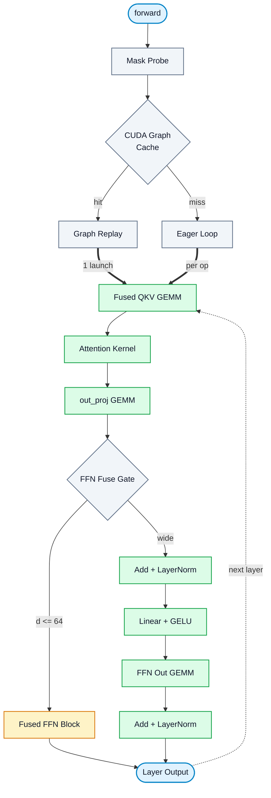
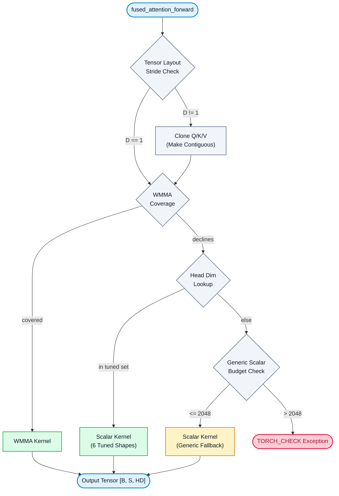
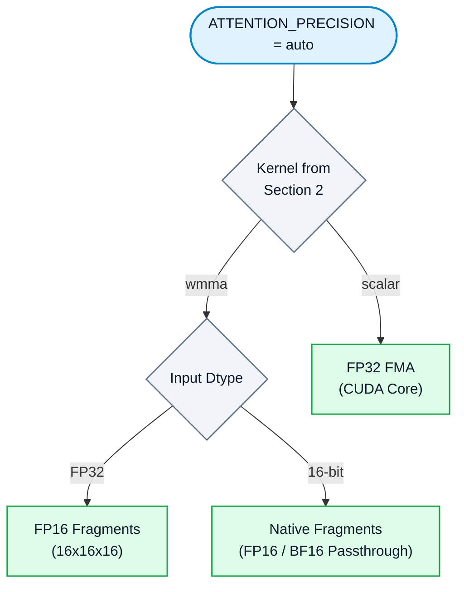
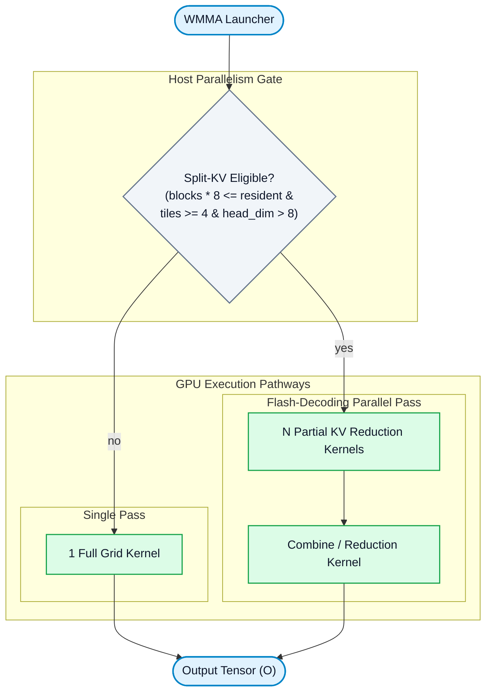
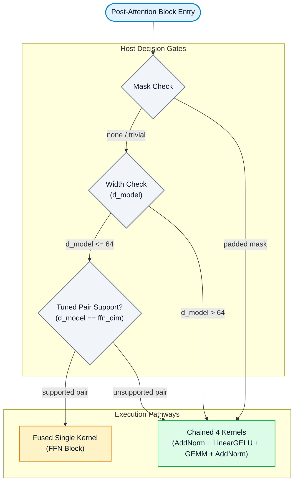
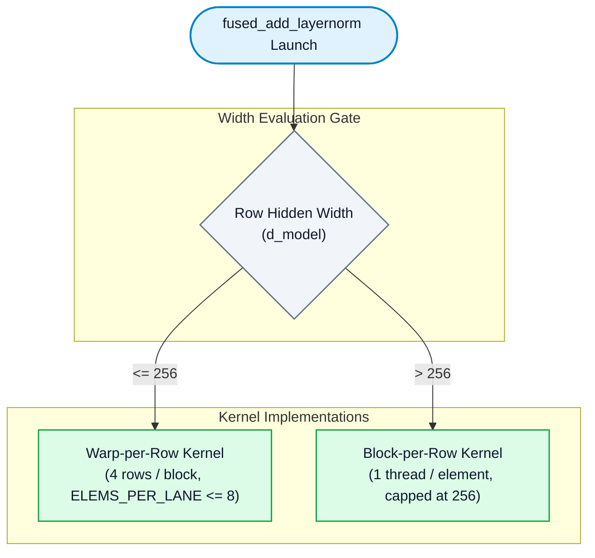

# Optimized Transformer: Pipeline, Host, and Device Architecture

Every decision is made on the host before anything is launched; the device only ever runs kernels. Thresholds come from [`optimized/config.py`](optimized/config.py) and the launchers in [`csrc/`](csrc).

Edge labels below indicate dispatch conditions, kept concise so arrows remain compact. The full rule behind each label is documented in the reference table following each diagram.

Sections 1-3 draw **only the default path**: every knob at the value
`optimized/config.py` ships (`ATTENTION_IMPL`, `ATTENTION_PRECISION`, `LINEAR_GELU`,
`FFN_BLOCK` and `CUDA_GRAPH` all `"auto"`, `MICROBATCH_FALLBACK` on). Branches a
forced `--attn-impl` or `--attn-precision` opens are listed under each diagram rather
than drawn, because nothing in a normal run can reach them.

---

## 1. Forward Pipeline

| Label | Rule | Source Location |
| :--- | :--- | :--- |
| `hit` | `(shape, dtype, device, use_mask, impl, linear_gelu, precision)` is present in `_graphs`. `ATTENTION_BACKEND` is deliberately absent: it has one legal value, so it can never make two calls differ | [`graphs._graph_key`](optimized/graphs.py) |
| `miss` | Not cached, or `_graph_eligible` declines: graphs disabled, non-CUDA device, capture already in progress, `_GRAPH_MAX_ENTRIES` reached, or activation exceeds `_GRAPH_MAX_ACTIVATION` | [`graphs._graph_eligible`](optimized/graphs.py) |
| `1` | Batch size is 1, or `MICROBATCH_FALLBACK` is off — single whole-batch eager pass | [`model.forward`](optimized/model.py) |
| `n` | Batch size > 1: predict peak memory, split up front if exceeding 85% device VRAM, then halve on every `OutOfMemoryError` | [`model._forward_chunk_on_oom`](optimized/model.py) |
| `d <= 64` | No mask (or trivial mask) **and** `d_model <= _FFN_BLOCK_MAX_D` **and** kernel has explicit `(d_model, ffn_dim)` instantiation | [`kernels._ffn_block`](optimized/kernels.py) |
| `wide` | Anything else — executes the full four-kernel chain | [`layers.MyTransformerBlock.forward`](optimized/layers.py) |

Colour carries the lane, so the diagram needs no swimlanes: grey is a host decision, green a device kernel, amber the fused block that replaces four of them. Thick arrows (`==>`) are kernel launches; thin arrows between green nodes are data dependencies. The device never hands control back to the host during execution.

One layer is drawn, and the dashed edge closes the loop over `num_layers`. The chunked path is not drawn: `_forward_chunk_on_oom` sits between the graph miss and the eager loop, and only changes how many rows each pass carries, not which kernels run. Rows `1` and `n` in the table below describe it.

`layers[0].norm1` is the single LayerNorm without a residual addition preceding it, so it executes independently before the loop. Every other LayerNorm is fused into its feeding residual addition — including the final block's norm, which absorbs `final_norm` so the model never issues a standalone call for it.

Because kernel launches are asynchronous, the host runs ahead, queuing kernel `n + 1` while the GPU executes kernel `n`. Consequently, evaluating the fusible-block branch incurs zero host latency: it only checks a memoized boolean flag and a tensor shape tuple known before layer execution begins. Measured with `torch.cuda.set_sync_debug_mode`, a steady-state forward pass on the fused path performs **zero** device-to-host synchronizations. Under CUDA graph replay, this branch is resolved at capture time and disappears completely. The mask probe is the single synchronization point in the pass, memoized via a `weakref` to the mask tensor; it costs one sync during warmup and zero during measured steady-state execution.

---

## 2. Attention: Kernel Dispatch Selection

`fused_attention_forward` in [`csrc/attention_dispatch.cuh`](csrc/attention_dispatch.cuh). Preparation preceding the selector is invariant across kernel choices.

| Label | Rule |
| :--- | :--- |
| `D == 1` | `q`, `k`, and `v` all satisfy `stride(3) == 1` with identical strides — fused QKV projection views qualify, requiring zero copies |
| `D != 1` | Non-contiguous layout: triggers `.contiguous()` and executes three tensor clone kernels |
| `covered` | Target GPU is SM 8.0+, `head_dim` $\in \{8, 16, 32, 64, 128, 256\}$, dtype is not `double`, and tile shared memory fits within budget (48 KB, or 96 KB carveout at `head_dim == 256`) |
| `declines` | WMMA does not cover the case, so `auto` falls through to the scalar family. This is the only fallthrough `auto` has; a forced `--attn-impl wmma` raises here instead |
| `in tuned set` | `head_dim` $\in \{8, 16, 32, 64, 128, 256\}$ **and** key tiles fit shared memory for the active dtype (e.g. `float64` past `head_dim == 16` exceeds budget) |
| `<= 2048` | Generic scalar kernel: `head_dim <= 2048` (max 32 threads/query row, single warp) and at least one key fits the 48 KB tile budget |
| `> 2048` | `head_dim > 2048`: query row threads cross warp boundaries, breaking warp-level score butterfly reductions. Requires a different reduction architecture, so it raises |

**Not drawn, because `auto` cannot reach it.** The tile family is never selected
by `auto` -- it covers only float32 and is a separate programming model the
caller opts into deliberately. So three edges that exist in the source are absent
above: the causal + explicit-mask fold (`tile_mode && causal && mask`, which
materializes an `[S, S]` triangle and forfeits the causal early exit), the tile
build/dtype/math-mode `TORCH_CHECK`s, and the `to_bshd` repack -- only the tile
kernels write `[B, H, S, head_dim]`, so only they need transposing. A forced
`--attn-impl scalar`, `wmma` or `tile*` also removes the `declines` fallthrough:
a forced impl gets that kernel or a `TORCH_CHECK`.

No prebuilt external fallback exists. `auto` selects among the kernels implemented within this file and raises when none cover the request; the legacy PyTorch SDPA path (which previously serviced `head_dim == 256` and `head_dim == 128` at $S=128$) has been removed. Measured on the two shapes previously routed to SDPA (causal, appendix dimensions):
- Op speedup: **0.820x** on shape 1, **1.009x** on shape 2.
- End-to-end model speedup: **0.992x** and **1.055x**.  
Removing SDPA cost 0.8% on one test shape while yielding a 5.5% gain on the other.

All 14 benchmark shapes have valid WMMA kernel coverage and execute via WMMA. The kernel streams softmax inline, avoiding full score matrix materialization.

The generic scalar node acts as the coverage floor. Non-standard `head_dim` values (such as `head_dim == 96` from `d_model == 768` with 8 heads) previously raised an exception; they now execute via the generic scalar kernel. This kernel accepts `head_dim`, threads per query row, and key tile dimensions as runtime values rather than template constants. It pads query rows to multiples of 64, so `head_dim == 96` incurs the workload of 128. Setting `SCALAR_FORCE_GENERIC=1` forces supported head dimensions through this path for differential testing.

---

## 3. Attention: Arithmetic Precision Axis

Orthogonal to Section 2: `Impl` designates kernel architecture, while `AttnPrecision` specifies the numeric contracting precision for its GEMMs. These were previously unified in a single parameter, which forced `tile-fp16` to specify both simultaneously while WMMA precision was controlled by a global `--attn-fp16` flag. Splitting them landed in `99c8cd8`; `--attn-impl tile-fp16` and friends were removed rather than kept as aliases -- pass the kernel to `--attn-impl` and the arithmetic to `--attn-precision`.

| Label | Rule |
| :--- | :--- |
| `wmma` / `scalar` | Whichever kernel Section 2 selected. `auto` never picks tile, so no `MathMode` is ever computed |
| `FP32` | The only dtype with a choice to make. `ATTENTION_PRECISION == "auto"` pushes `wmma_set_fp16(True)` once, on change rather than per call (`kernels._sync_attention_precision`), and `AttnPrecision::Auto` then reads that flag -- so the default resolves to FP16 fragments every time |
| `16-bit` | Tensors supplied in `fp16` or `bfloat16` contract in their native precision. The precision argument applies solely to **fp32 inputs** -- narrowing further is impossible, and widening back cannot restore lost mantissa bits |

**Not drawn.** `AttnPrecision::Fp16`, `Bf16` and `Tf32` are explicit requests that
override the flag, and `--attn-precision tf32` flips the flag itself so `Auto`
resolves to TF32 fragments (16x16x8) instead. BF16 fragments exist for
measurement only. None of the three is reachable with the shipped defaults; the
combinations that exist at all are below.

### Supported Kernel & Precision Combinations

| Kernel Axis | FP32 | TF32 | FP16 | BF16 |
| :--- | :---: | :---: | :---: | :---: |
| **Scalar** | Yes | — | — | — |
| **WMMA** | — | Yes | Yes | Testing Only |
| **Tile** | Yes | Yes | Yes | Yes |

- **WMMA**: Lacks full FP32 because hardware Tensor Cores do not execute full FP32 matrix multiplication instructions.
- **Scalar**: Restricted to FP32 accumulated execution because explicit float accumulation is its primary design objective. Passing half-precision *tensors* is handled independently via the `--dtype` axis.

FP16 is the default precision for FP32 inputs because TF32 and FP16 share an identical 10-bit mantissa. Evaluated against an FP64 reference, TF32 and FP16 match to three significant figures across all test configurations. Using FP16 achieves **2.0x–2.25x** higher Tensor Core execution throughput, doubles $K$ elements per fragment, and halves staged tile shared-memory footprint. BF16 is exposed exclusively for diagnostic testing; its 8-bit significand produced relative errors of 425%–622% against the harness tolerance threshold ($2 \times 10^{-3}$).

---

## 4. Inside WMMA: Split-KV (Flash-Decoding)

Flash-Decoding splits key sequence length to maximize GPU utilization. The standard attention grid is `(ceil(S / BLOCK_M), H, B)`. For small batch sizes and short sequences, this grid leaves GPU multiprocessors idle; splitting the key range introduces a second combine kernel launch in exchange for increased CTA parallelism.

Split-KV execution requires **all** of the following conditions:
1. Feature flag enabled.
2. `head_dim > 8`.
3. `blocks * 8 <= resident` (grid occupies $\le 1/8$ of total GPU multiprocessor capacity).
4. At least 4 key tiles available to divide.
5. `resident / blocks >= 2` (clamped to available tile count).

The split count acts as a floor, never a ceiling: oversubscribing GPU capacity serializes extra CTA blocks into a second wave while still incurring combine kernel overhead.

These strict gating thresholds were established empirically:
- Relaxing the occupancy threshold to `blocks * 4 <= resident` reduced performance to **0.898x**.
- Removing the 4-tile requirement yielded **1.084x** speedup on standalone attention but degraded model end-to-end performance to **0.963x** due to combine kernel launch overhead across deep layers.

---

## 5. Post-Attention Block: Fused vs. Chained

| Label | Rule |
| :--- | :--- |
| `padded` | Explicit padded mask tensor present. Padded rows are zeroed *between* residual addition and LayerNorm; reference LayerNorm normalizes zeroed elements rather than unpadded sums, preventing kernel fusion |
| `<= 64` | `config._FFN_BLOCK_MAX_D`, host preference in [`optimized/kernels.py`](optimized/kernels.py). (`FFN_BLOCK="force"` overrides this for A/B testing) |
| `pair` | Fused kernel instantiates explicit `(d_model, ffn_dim)` pairs: `(128,128)`, `(64,64)`, `(48,48)`, `(32,32)`, and `(16,16)`. Each pair requires macro expansion of two WMMA GEMMs; mismatched dimensions (`d_model != ffn_dim`) force unfused execution |

### Performance Profile (Fused vs. Chained Baseline)

Measured against the tuned `linear_gelu` kernel baseline:

| `d_model` | Test Shape | Fused / Chained Speedup |
| :---: | :---: | :---: |
| **32** | Shape 7 | **5.60x** |
| **128** | Shape 1 | 0.979x |
| **128** | Shape 5 | 0.959x |
| **128** | Shape 13 | 0.919x |
| **128** | Shape 6 | 0.897x |

This crossover point is architectural: the second GEMM reduces across `ffn_dim`, preventing a thread block from emitting output columns until the full intermediate row is stored in shared memory. This constrains the row tile to $M=16$ (a single WMMA tile). Conversely, unfused `linear_gelu` configures larger row tile dimensions, achieving higher arithmetic intensity per weight byte loaded. At `d_model <= 64`, eliminating 4 kernel launches outweighs suboptimal tiling; above `d_model == 64`, launch overhead savings no longer compensate for tiling constraints.

---

## 6. Add + LayerNorm: Warp-per-Row vs. Block-per-Row

`d_model <= 256` represents a hard hardware ceiling: the launcher instantiates up to `ELEMS_PER_LANE = 8`, yielding $8 \times 32 = 256$ elements per warp. Overriding this threshold drops tail elements, so `layernorm_warp_width()` strictly clamps values. The warp kernel packs 4 rows per thread block. The block kernel assigns one thread per element, rounded up to full warps and capped at 256 threads.

This optimization delivers **2.2x** kernel speedup and **1.02x–1.11x** end-to-end model speedup. Note that initial occupancy hypotheses were incorrect: single-row thread blocks exhibit identical occupancy to block-per-row implementations and already win, while performance across multi-row sweeps remains flat.

---

## 7. Linear + GELU Fusion

[`optimized/kernels.py`](optimized/kernels.py) invokes `_linear_gelu` when `LINEAR_GELU != "off"` and Linear bias is enabled. If the extension cannot service a configuration, it returns `None`, causing the host to fall back to `F.gelu(F.linear(...))`.

Fallbacks occur exclusively on coverage constraints: `float32` input, `K % 4 == 0`, and SM 8.0+. When running with FP16 fragments, this fused kernel outperforms cuBLAS combined with a separate GELU kernel across all evaluated grid configurations (delivering **1.24x–2.40x** speedup across grid dimensions from 2 to 20,000 tiles). Block tile layouts are selected per shape via `pick_gemm_tile(M, N, K)`.

---

## 8. Dispatch Thresholds Reference

| Parameter Constant | Value | Behavioral Effect |
| :--- | :--- | :--- |
| `_GRAPH_MAX_ACTIVATION` | `524288` | Activation volume (`batch * seq * d_model`) ceiling; larger passes execute in eager mode. (Shapes 2, 3, 4, and 12 replay) |
| `_GRAPH_MAX_ENTRIES` | `4` | Max distinct CUDA Graph cache entries per model instance; each maintains a dedicated memory pool |
| `_GRAPH_POOL_SAFETY_FRACTION` | `0.25` | Captured graph pool memory cap; pools exceeding 25% GPU VRAM are released |
| `_FFN_BLOCK_MAX_D` | `64` | Maximum `d_model` for fused FFN block execution; larger dimensions execute unfused 4-kernel chain |
| `layernorm_warp_width` | `256` | Hidden dimension threshold: $\le 256$ uses warp-per-row LayerNorm; $> 256$ uses block-per-row |
| `_MICROBATCH_PEAK_FACTOR` | `10` | Peak memory prediction multiplier per row, evaluated against 85% VRAM to set batch splitting |
| `_MICROBATCH_BUDGET_FRACTION` | `0.85` | VRAM allocation budget limit (preserves whole-batch execution for shape 6 at 6.10 GiB / 6.80 GiB) |
| `generic scalar ceiling` | `2048` | Maximum `head_dim` supported by generic scalar kernel before thread counts exceed single-warp reductions |
| `wmma head_dim set` | `8, 16, 32, 64, 128, 256` | WMMA hardware target set (requires SM 8.0+ and valid shared memory allocation) |
| `wmma split-KV gate` | `blocks * 8 <= resident` | Flash-Decoding trigger conditions (requires 4+ key tiles, `head_dim > 8`, and $\ge 2$ split ratio) |

---

## 9. Status

The two-axis dispatch split documented in Sections 2 and 3 is **complete** as of `99c8cd8`
("Separate the attention kernel from the arithmetic it uses"), and the source comments describing
it have been brought in line. Nothing is open.

The split touched three layers, all landed: `run_kernel` carries only the four kernel choices and
derives the tile math mode through `tile_math_for(prec)`; `AttnArgs::prec` is populated in
`fused_attention_forward` and read by both `launch_wmma` and the tile launcher; and
`--attn-precision` is its own flag, backed by `config.ATTENTION_PRECISION` and
`config._PRECISION_CODE`. The old fused spellings (`tile-fp16`, `tile-tf32`, `tile-bf16`) were
removed rather than kept as aliases: `--attn-impl` rejects them in
[`optimized/cli.py`](optimized/cli.py) and [`dashboard/argspec.py`](dashboard/argspec.py), and
`impl > 3` raises in [`csrc/attention_dispatch.cuh`](csrc/attention_dispatch.cuh) with a message
naming the two axes to move to. `optimized/graphs.py` keys captures on `ATTENTION_PRECISION` rather
than the former `attn_fp16`, and drops `ATTENTION_BACKEND` from the key entirely now that it has one
legal value.
