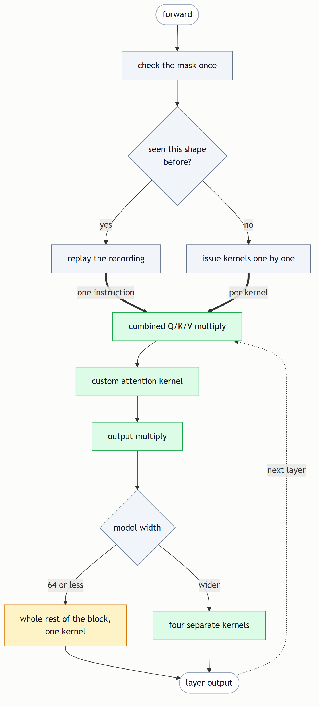
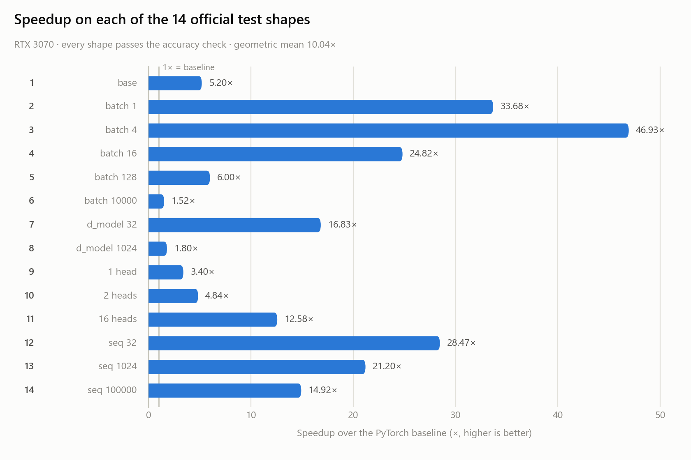

# Distraction - *A faster GPU Kernel for Transformer Layers*
A from-scratch GPU implementation of Transformer self-attention that runs up to **39× faster** than
the PyTorch baseline on the official test shapes, with every shape passing the accuracy check.

---

## How it addresses the problem statement

Problem Statement 3 asks for a Transformer layer accelerated with custom GPU kernels, graded
against a baseline implementation number by number. The tolerance is the hard part: the obvious
routes to speed — lower precision, mathematical shortcuts — are exactly the routes to failing.

**The starting point was measurement, not optimization.** Profiling the baseline showed that
attention is not limited by arithmetic. At long sequences, under a third of the time is spent
calculating; the rest goes on moving one enormous table — the grid of relevance scores that
attention produces — out to the graphics card's main memory and reading it back, five separate
times.

**So the solution stops moving it.** The attention kernel builds that grid in small pieces that
never leave the chip. Each piece is created, scaled, masked, softmaxed and multiplied into the
running result while still in fast local memory, then discarded. The full grid is never written
anywhere.

One layer of the finished model. Grey is a decision made on the processor before anything is
sent to the card, green a kernel on the card, amber the fused kernel that replaces four of
them:

*Every gate above is explained, with the measurement behind it, in the [Technical Report](https://github.com/jazwinn/Distraction-OptimizedTransformerLayer/blob/main/TechnicalReport.md) — and
drawn out in full, one decision at a time, in the [dispatch graph](https://github.com/jazwinn/Distraction-OptimizedTransformerLayer/blob/main/attention_dispatch_graph.md).*

Twenty optimizations in all address what the profiling exposed:

| Optimization | What it does |
| --- | --- |
| **A custom attention kernel** | Attention runs on a kernel written for this project rather than PyTorch's own fused attention, SDPA. Timed against it on the attention step alone, it wins **every** case measured, by **1.7× to 5.8×** — the score grid never leaves the chip, both matrix multiplications run on the card's dedicated matrix-multiply hardware in fp16 (same precision as the alternative, roughly twice the speed), and the tile shape is swept per head size rather than fixed once |
| **Kernel fusion** | Neighbouring steps become single kernels, so intermediate results stay on chip. Below a model width of 64, the entire post-attention chain — normalise, expand, activate, shrink, normalise — is one kernel |
| **Skipping discarded work** | Under causal masking over half the score grid would be computed and thrown away; those regions are never computed |
| **One combined projection** | Query, Key and Value become a single wide multiplication instead of three narrow ones too small to fill the card |
| **CUDA graph replay** | On small shapes the card finishes each instruction before the next arrives. The whole kernel sequence is recorded once and replayed as a single submission |
| **Reading data in place** | Query, Key and Value are read where they already sit rather than copied into shape first |

*Six of the twenty are listed here — the [Technical Report](https://github.com/jazwinn/Distraction-OptimizedTransformerLayer/blob/main/TechnicalReport.md) covers all of them, each with the measurement that justified it.*

## Results

All fourteen official test shapes, on an RTX 3070. Every one passes, with zero failing values out
of billions compared.

*Every shape runs faster than the baseline. The gains are largest where the card was sitting idle —
a batch of 1 spends almost all its time waiting for instructions rather than computing — and
smallest on the widest model, where the baseline was already keeping the card busy.*

| Across all fourteen shapes | Speedup |
| --- | ---: |
| Best — batch of 1 | **39.67×** |
| Median | **9.39×** |
| Geometric mean | **8.13×** |
| Worst — widest model | **1.41×** |
| Shapes failing accuracy | **0 of 14** |

The largest shape — a batch of 32 sequences of 100,000 words — exceeds the card's 8 GB of memory
outright, so the model predicts the requirement in advance and processes it in slices rather than
failing.

## Challenges I ran into

**Test case 14 should not have been runnable at all — and it runs.** It is 32 sequences of 100,000
words, needing **12.2 GB** of input on a card with **8 GB**; the original implementation is worse
off still, wanting a 10 GB mask and a **20.5 TB** grid of scores. Windows does not fail cleanly on
this — it silently spills into system memory and grinds, which hung the machine outright the first
time. So the model now estimates what it needs *before* starting and processes the batch in slices,
which is mathematically identical because sequences in a batch never interact. Peak usage fell to
3.8 GB and the case passes with **zero failing values out of 6.55 billion**, at **22.84×**.

**AI drifts, and it drifts towards complexity.** Asked to implement a feature, an agent will
happily return a redesign of something else; asked a yes-or-no question, three paragraphs of
terminology to say "no". More than once, elaborate restructuring was proposed where the real answer
was a single threshold — one line, one number, measured. What worked was keeping the objective
written down and visible, asking for the one-line version before the explanation, refusing any
proposal that could not be stated plainly, and requiring a measurement rather than an argument.

## What I learned

**How NVIDIA's GPU generations differ, and how to get the most out of one.** A card has a fixed
budget of registers and on-chip memory, its own matrix-multiply unit, and a number format it happens
to be fast at — on this one, fp16 runs **2.0× to 2.25×** quicker at the same precision. Every tuned
value here was measured on this card and does not transfer to another.

**Two ways of reaching the matrix-multiply hardware.** I wrote attention with `wmma`, where you
manage fragments of the matrix yourself, and again with NVIDIA's newer tile model, which is far
easier to write. The hand-written one won every case; understanding *why* the easier one lost was
worth more than the difference.

**Profiling with Nsight, including how it misleads.** It shows whether a kernel is waiting on
arithmetic or on memory — but traced timings are inflated, and a recorded command list logs as one
opaque entry, which made a pass read as "2 kernels, 0.3% busy" when it was really **75 kernels at
95.1% busy**.

**Reading performance instead of guessing at it.** The useful question was always whether a kernel
waits on arithmetic or on data. Here it was always data: attention uses the matrix-multiply units
only **13%** of the time, so doing less arithmetic would buy nothing.

**AI is confident whether or not it is right.** A wrong kernel reads just as reasonably as a correct
one — only a measurement separates them. So every optimization was left switchable, and every tuned
number written down beside the run that produced it.

## Development tools used

| Tool | How it was used |
| --- | --- |
| **Claude Code (Claude Opus)** | Primary development environment for writing, debugging and documenting the kernels |
| **NVIDIA CUDA Toolkit 13.3** | nvcc compiler, plus cuobjdump for inspecting the compiled GPU instructions |
| **Microsoft Visual C++ (MSVC 14.44)** | Host compiler, located automatically via vswhere and vcvarsall.bat |
| **ninja** | Build system, driven automatically by PyTorch's extension loader |
| **NVIDIA Nsight Systems** | Timeline profiling — what share of each pass the GPU spends actually running kernels |
| **NVIDIA Nsight Compute** | Per-kernel counters — whether a kernel is limited by arithmetic, memory bandwidth, or neither |
| **Custom benchmark dashboard** | A local web application built for this project, wrapping the benchmark and verification scripts and enforcing the measurement rules automatically |
| **Git** | Version control |

## APIs used

No web or third-party service APIs. The APIs in question are compute interfaces:

| Interface | What it provides |
| --- | --- |
| **CUDA C++ / CUDA Runtime API** | The kernels themselves |
| **nvcuda::wmma** | Fragment-level interface to the GPU's matrix-multiply hardware |
| **CUDA tile programming model** | NVIDIA's newer block-level interface, used to build a third implementation as a comparison |
| **CUDA Graphs** | Recording and replaying a kernel sequence to remove launch overhead |
| **PyTorch C++ extension API** | Compiles the CUDA sources and exposes them to Python |
| **Python http.server** | The dashboard's web server — ThreadingHTTPServer from the standard library, serving its own JSON endpoints. No web framework |
| **Browser fetch and localStorage** | The dashboard's front end talks to that server with fetch and remembers the chosen settings in localStorage. No other browser API is used |
| **Nsight command-line interfaces** | The dashboard drives profiling by invoking ncu and nsys directly and parsing their CSV output |
| **Anthropic Claude (Opus)** | AI assistance — kernel development, measurement, documentation |
| **Google Gemini Flash** | AI assistance — supporting questions and concept checks |

## Libraries and frameworks used

| Library | How it is used |
| --- | --- |
| **PyTorch 2.12.0+cu132** | Tensors, the baseline implementation, and the benchmark harness |
| **cuBLAS** (via PyTorch) | The projection and feed-forward matrix multiplications |
| **PyTorch's cpp_extension** | Just-in-time compilation of the CUDA extension |
| **Python standard library** | Everything else, including the whole dashboard — http.server for serving, subprocess and runpy for launching runs, threading and queue for the one-run-at-a-time job queue, json/csv/ast/re for parsing harness and profiler output, ctypes for preloading a DLL. No NumPy |
| **Hand-written HTML, CSS and JavaScript** | The dashboard's front end is one HTML file, one stylesheet and one script, with no framework, no build step and no CDN — nothing is fetched from a third party at page load |
| **CUDA-Agent** *(ByteDance / Tsinghua)* | A published CUDA kernel development agent. Not usable as shipped — it targets a different sandbox and newer hardware — but its optimization ordering and verification checklists were adapted into a project-specific procedure |

Deliberately **not** used: Triton, and therefore `torch.compile`, neither of which has a working
Windows build in this environment.

## Datasets and assets used

**No external datasets.** This is a kernel optimization problem, not a modelling one — correctness
is judged by comparing two implementations of the same mathematics on identical inputs, so no
real-world data is required or would add anything.

| Asset | What it is |
| --- | --- |
| **Randomly generated tensors** | Produced by the provided benchmark harness from a fixed seed, so every run is reproducible and both implementations see identical inputs |
| **The 14 official test shapes** | Transcribed from the problem statement's Appendix into a preset file, editable through the dashboard |
| **Model weights** | Randomly initialised, then copied from the baseline into the optimized model so both compute with identical parameters |

## Documentation

- **[Technical Report](https://github.com/jazwinn/Distraction-OptimizedTransformerLayer/blob/main/TechnicalReport.md)** — the full write-up: the baseline analysis and profiling that motivated
  every change, the design decisions, all twenty optimizations, the dispatch architecture, complete
  results, and limitations.
- **[README](https://github.com/jazwinn/Distraction-OptimizedTransformerLayer/blob/main/README.md)** — installation, build, verification, and how the code is organised.
